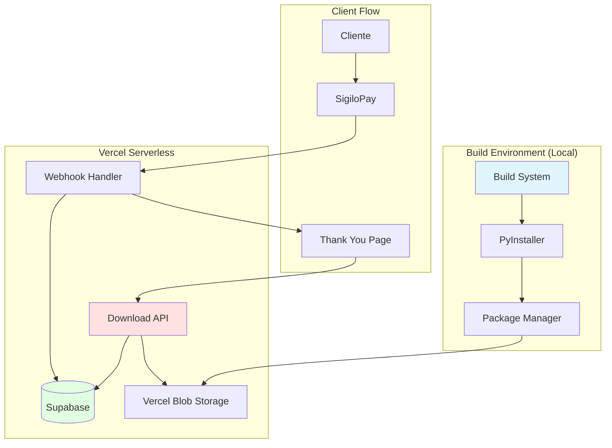

# Design Document: Executable Packaging and Distribution System

## Overview

Este documento descreve o design técnico do sistema de empacotamento e distribuição do LeadExtract. O sistema transforma o código Python em um executável standalone, empacota-o com documentação e bônus, e disponibiliza para download através de uma API serverless integrada ao fluxo de pagamento SigiloPay.

### Objetivos

- Compilar o sistema Python em executável Windows standalone usando PyInstaller
- Empacotar executável com documentação e arquivos adicionais em formato .zip
- Fornecer API de download segura com validação de pagamento
- Controlar acesso através de tokens temporários com limite de downloads
- Automatizar todo o processo de build, empacotamento e deploy

### Escopo

O sistema cobre:
- Build automatizado do executável usando PyInstaller
- Geração de manifests com metadados e checksums
- Criação de pacotes .zip de distribuição
- API serverless para validação e download
- Integração com webhook SigiloPay para geração de tokens
- Sistema de rate limiting e controle de acesso
- Logs e auditoria de downloads

Fora do escopo:
- Builds para macOS ou Linux
- Sistema de atualização automática
- Interface administrativa para gerenciar downloads
- Sistema de licenciamento avançado

## Architecture

### Visão Geral da Arquitetura

O sistema é composto por três componentes principais:

1. **Build System**: Script Python local que compila, empacota e prepara distribuição
2. **Distribution API**: Endpoints serverless (Vercel) que validam e servem downloads
3. **Storage Layer**: Vercel Blob Storage para armazenar pacotes .zip



### Fluxo de Dados

1. **Build Flow**:
   - Desenvolvedor executa `build.py`
   - PyInstaller compila Python → LeadExtractor.exe
   - Sistema gera BUILD_MANIFEST.json com checksums
   - Package Manager cria .zip com executável + documentação
   - Upload para Vercel Blob Storage
   - Arquivo também copiado para public/downloads/

2. **Payment & Token Generation Flow**:
   - Cliente completa pagamento no SigiloPay
   - Webhook notifica sistema Vercel
   - Sistema valida pagamento e cria subscription
   - Sistema gera Download_Token (UUID v4)
   - Token armazenado em tabela downloads com expires_at = now() + 7 dias
   - Token retornado para Thank You Page
   - Email enviado com link de download

3. **Download Flow**:
   - Cliente acessa /api/download/:token
   - API valida token (existe, não expirado, limite não atingido)
   - API incrementa download_count
   - API atualiza last_downloaded_at
   - API serve arquivo .zip do Blob Storage
   - Log registrado para auditoria

### Decisões Arquiteturais

**DA-1: PyInstaller em modo --onefile**
- Decisão: Usar --onefile para gerar executável único
- Razão: Simplifica distribuição e experiência do usuário (um único .exe)
- Trade-off: Tempo de inicialização ligeiramente maior (extração temporária)

**DA-2: Vercel Blob Storage para distribuição**
- Decisão: Armazenar .zip no Vercel Blob Storage
- Razão: CDN global, alta disponibilidade, integração nativa com Vercel
- Alternativa considerada: Supabase Storage (descartada por custo de bandwidth)

**DA-3: Tokens UUID v4 com expiração**
- Decisão: Tokens únicos por pagamento com validade de 7 dias
- Razão: Segurança adequada sem complexidade de JWT, alinhado com garantia de 7 dias
- Trade-off: Requer consulta ao banco em cada download

**DA-4: Limite de 3 downloads por token**
- Decisão: Permitir até 3 downloads por token
- Razão: Permite re-download em caso de problemas, mas previne compartilhamento excessivo
- Alternativa considerada: Download único (descartada por UX ruim)

**DA-5: Build local vs CI/CD**
- Decisão: Build executado localmente pelo desenvolvedor
- Razão: Simplicidade inicial, evita complexidade de CI/CD para Windows builds
- Futuro: Migrar para GitHub Actions quando volume aumentar

## Components and Interfaces

### 1. Build System (build.py)

Script Python que orquestra todo o processo de build e empacotamento.

**Responsabilidades**:
- Limpar diretórios de build anteriores
- Executar PyInstaller com configuração correta
- Gerar BUILD_MANIFEST.json
- Criar pacote .zip de distribuição
- Upload para Vercel Blob Storage
- Validar integridade do build

**Interface**:
```python
class BuildSystem:
    def clean_build_directories(self) -> None:
        """Remove dist/ e build/ de builds anteriores"""
        
    def compile_executable(self) -> Path:
        """
        Executa PyInstaller e retorna caminho do executável gerado
        Raises: BuildError se compilação falhar
        """
        
    def generate_manifest(self, exe_path: Path) -> dict:
        """
        Gera BUILD_MANIFEST.json com metadados do build
        Returns: Dict com version, build_date, checksum, etc.
        """
        
    def create_distribution_package(self, exe_path: Path, manifest: dict) -> Path:
        """
        Cria arquivo .zip com executável, documentação e bônus
        Returns: Caminho do arquivo .zip criado
        """
        
    def upload_to_storage(self, zip_path: Path) -> str:
        """
        Faz upload do .zip para Vercel Blob Storage
        Returns: URL do arquivo no storage
        """
        
    def validate_build(self, exe_path: Path) -> bool:
        """
        Valida integridade do executável (tamanho, executável válido)
        Returns: True se válido, False caso contrário
        """
        
    def run(self) -> None:
        """Executa todo o processo de build"""
```

**Dependências**:
- PyInstaller: Compilação Python → .exe
- hashlib: Cálculo de checksums SHA-256
- zipfile: Criação de pacotes .zip
- vercel-blob (SDK): Upload para Blob Storage
- pathlib: Manipulação de caminhos

**Configuração PyInstaller**:
```python
pyinstaller_args = [
    'automation_engine.py',  # Entry point
    '--onefile',             # Executável único
    '--windowed',            # Sem console
    '--name=LeadExtractor',  # Nome do executável
    '--add-data=license.key;.',  # Incluir license key
    '--hidden-import=playwright',
    '--hidden-import=pandas',
    '--hidden-import=openpyxl',
    '--collect-all=playwright',
    '--icon=icon.ico',       # Ícone do executável
]
```

### 2. Package Manager

Componente responsável por criar o pacote .zip de distribuição.

**Responsabilidades**:
- Gerar arquivo LEIA-ME.txt com instruções
- Criar estrutura do pacote .zip
- Adicionar executável, manifest, documentação e bônus
- Aplicar compressão máxima
- Validar tamanho final do pacote

**Interface**:
```python
class PackageManager:
    def generate_readme(self, version: str, build_date: str) -> str:
        """
        Gera conteúdo do LEIA-ME.txt em português
        Returns: String com conteúdo formatado
        """
        
    def create_package(
        self,
        exe_path: Path,
        manifest: dict,
        readme_content: str,
        bonus_files: List[Path]
    ) -> Path:
        """
        Cria arquivo .zip com todos os componentes
        Returns: Caminho do .zip criado
        """
        
    def get_package_name(self, version: str) -> str:
        """
        Gera nome do pacote no formato LeadExtractPro_v{version}_{timestamp}.zip
        Returns: Nome do arquivo
        """
```

**Estrutura do Pacote .zip**:
```
LeadExtractPro_v3.0.0_20240115.zip
├── LeadExtractor.exe
├── BUILD_MANIFEST.json
├── LEIA-ME.txt
└── bonus/
    ├── guia-linkedin-avancado.pdf
    └── templates-mensagens.pdf
```

### 3. Distribution API

Endpoints serverless (Vercel Functions) para validação e download.

**Endpoints**:

#### GET /api/download/:token

Valida token e serve arquivo .zip para download.

**Request**:
```
GET /api/download/550e8400-e29b-41d4-a716-446655440000
```

**Response (Success - 200)**:
```
Content-Type: application/zip
Content-Disposition: attachment; filename="LeadExtractPro_v3.0.0_20240115.zip"
X-Checksum-SHA256: a3b2c1d4e5f6...
Content-Length: 180000000

[binary data]
```

**Response (Token Not Found - 404)**:
```json
{
  "error": "Token não encontrado",
  "code": "TOKEN_NOT_FOUND"
}
```

**Response (Token Expired - 410)**:
```json
{
  "error": "Token expirado. Entre em contato com o suporte.",
  "code": "TOKEN_EXPIRED",
  "expired_at": "2024-01-08T10:30:00Z"
}
```

**Response (Download Limit Exceeded - 429)**:
```json
{
  "error": "Limite de downloads atingido (3/3)",
  "code": "DOWNLOAD_LIMIT_EXCEEDED",
  "downloads_used": 3,
  "max_downloads": 3
}
```

**Response (Rate Limited - 429)**:
```json
{
  "error": "Muitas requisições. Tente novamente em 60 segundos.",
  "code": "RATE_LIMIT_EXCEEDED",
  "retry_after": 60
}
```

**Interface**:
```typescript
interface DownloadHandler {
  validateToken(token: string): Promise<DownloadRecord | null>;
  checkExpiration(record: DownloadRecord): boolean;
  checkDownloadLimit(record: DownloadRecord): boolean;
  incrementDownloadCount(token: string): Promise<void>;
  getFileFromStorage(filename: string): Promise<Blob>;
  logDownload(token: string, ip: string, userAgent: string): Promise<void>;
}

interface DownloadRecord {
  id: string;
  token: string;
  payment_id: string;
  customer_id: string;
  download_count: number;
  max_downloads: number;
  expires_at: Date;
  created_at: Date;
  last_downloaded_at: Date | null;
}
```

### 4. Webhook Integration

Extensão do webhook SigiloPay existente para gerar tokens de download.

**Responsabilidades**:
- Detectar pagamentos aprovados
- Gerar Download_Token único
- Criar registro na tabela downloads
- Enviar email com link de download
- Retornar token para frontend

**Interface**:
```typescript
interface DownloadTokenGenerator {
  generateToken(): string;  // UUID v4
  createDownloadRecord(
    token: string,
    paymentId: string,
    customerId: string
  ): Promise<void>;
  sendDownloadEmail(
    customerEmail: string,
    token: string,
    customerName: string
  ): Promise<void>;
}
```

**Integração com Webhook Existente**:
```typescript
// Em api/webhooks/sigilopay.ts
async function handlePaymentApproved(payment: Payment) {
  // ... código existente de subscription ...
  
  // Gerar token de download
  const token = generateToken();
  await createDownloadRecord(token, payment.id, payment.customer_id);
  
  // Enviar email
  await sendDownloadEmail(
    payment.customer_email,
    token,
    payment.customer_name
  );
  
  // Retornar token para frontend
  return {
    success: true,
    subscription_id: subscription.id,
    download_token: token  // Novo campo
  };
}
```

### 5. Email Service

Serviço para enviar emails com link de download.

**Template de Email**:
```html
<!DOCTYPE html>
<html>
<head>
  <meta charset="UTF-8">
  <title>Seu LeadExtractor está pronto!</title>
</head>
<body>
  <h1>🎉 Seu LeadExtractor está pronto para download!</h1>
  
  <p>Olá {{customer_name}},</p>
  
  <p>Seu pagamento foi confirmado e o LeadExtractor Pro está pronto para uso!</p>
  
  <a href="{{download_url}}" style="...">
    Baixar LeadExtractor Pro
  </a>
  
  <h2>📋 Instruções</h2>
  <ol>
    <li>Clique no botão acima para baixar o arquivo .zip</li>
    <li>Extraia o arquivo LeadExtractor.exe</li>
    <li>Execute o LeadExtractor.exe</li>
    <li>Siga as instruções na tela</li>
  </ol>
  
  <h2>⚠️ Informações Importantes</h2>
  <ul>
    <li>Link válido por 7 dias</li>
    <li>Máximo de 3 downloads</li>
    <li>Garantia de 7 dias</li>
  </ul>
  
  <p>Precisa de ajuda? <a href="{{support_url}}">Contate o suporte</a></p>
</body>
</html>
```

**Interface**:
```typescript
interface EmailService {
  sendDownloadEmail(params: {
    to: string;
    customerName: string;
    downloadUrl: string;
    expiresAt: Date;
  }): Promise<void>;
}
```

### 6. Rate Limiter

Componente para controlar taxa de downloads e prevenir abuso.

**Estratégias de Rate Limiting**:
1. **Por Token**: Máximo 3 downloads totais (persistido no banco)
2. **Por IP**: Máximo 1 download por minuto (cache em memória/Redis)

**Interface**:
```typescript
interface RateLimiter {
  checkTokenLimit(token: string): Promise<boolean>;
  checkIpLimit(ip: string): Promise<boolean>;
  recordDownload(token: string, ip: string): Promise<void>;
}
```

**Implementação com Vercel KV** (opcional):
```typescript
import { kv } from '@vercel/kv';

async function checkIpLimit(ip: string): Promise<boolean> {
  const key = `ratelimit:ip:${ip}`;
  const count = await kv.get<number>(key) || 0;
  
  if (count >= 1) {
    return false;  // Limite excedido
  }
  
  await kv.set(key, count + 1, { ex: 60 });  // Expira em 60 segundos
  return true;
}
```

## Data Models

### Tabela: downloads

Armazena tokens de download autorizados e controla acesso.

```sql
CREATE TABLE downloads (
  id UUID PRIMARY KEY DEFAULT gen_random_uuid(),
  token UUID UNIQUE NOT NULL,
  payment_id UUID NOT NULL REFERENCES payments(id) ON DELETE CASCADE,
  customer_id UUID NOT NULL REFERENCES customers(id) ON DELETE CASCADE,
  download_count INTEGER NOT NULL DEFAULT 0,
  max_downloads INTEGER NOT NULL DEFAULT 3,
  expires_at TIMESTAMP WITH TIME ZONE NOT NULL,
  created_at TIMESTAMP WITH TIME ZONE NOT NULL DEFAULT NOW(),
  last_downloaded_at TIMESTAMP WITH TIME ZONE,
  
  CONSTRAINT valid_download_count CHECK (download_count >= 0),
  CONSTRAINT valid_max_downloads CHECK (max_downloads > 0),
  CONSTRAINT expires_after_creation CHECK (expires_at > created_at)
);

CREATE INDEX idx_downloads_token ON downloads(token);
CREATE INDEX idx_downloads_payment_id ON downloads(payment_id);
CREATE INDEX idx_downloads_customer_id ON downloads(customer_id);
CREATE INDEX idx_downloads_expires_at ON downloads(expires_at);
```

**Campos**:
- `id`: Identificador único do registro
- `token`: UUID v4 usado na URL de download
- `payment_id`: Referência ao pagamento que autorizou o download
- `customer_id`: Referência ao cliente que fez o pagamento
- `download_count`: Contador de downloads realizados
- `max_downloads`: Limite máximo de downloads permitidos
- `expires_at`: Data/hora de expiração do token (created_at + 7 dias)
- `created_at`: Data/hora de criação do token
- `last_downloaded_at`: Data/hora do último download (NULL se nunca baixado)

**Índices**:
- `idx_downloads_token`: Busca rápida por token (usado em cada download)
- `idx_downloads_payment_id`: Relacionamento com pagamentos
- `idx_downloads_customer_id`: Relacionamento com clientes
- `idx_downloads_expires_at`: Limpeza de tokens expirados

### BUILD_MANIFEST.json

Arquivo JSON gerado durante o build contendo metadados.

```json
{
  "version": "3.0.0",
  "build_date": "2024-01-15T14:30:00Z",
  "checksum_sha256": "a3b2c1d4e5f6789012345678901234567890123456789012345678901234567890",
  "file_size": 185000000,
  "python_version": "3.11.5",
  "dependencies": {
    "playwright": "1.40.0",
    "pandas": "2.1.4",
    "openpyxl": "3.1.2",
    "customtkinter": "5.2.1"
  },
  "build_config": {
    "pyinstaller_version": "6.3.0",
    "mode": "onefile",
    "windowed": true,
    "platform": "win_amd64"
  },
  "package_info": {
    "zip_filename": "LeadExtractPro_v3.0.0_20240115.zip",
    "zip_checksum": "b4c3d2e1f0a9b8c7d6e5f4a3b2c1d0e9f8a7b6c5d4e3f2a1b0c9d8e7f6a5b4c3",
    "zip_size": 180000000
  }
}
```

### Estrutura de Logs

Logs estruturados para auditoria e monitoramento.

```typescript
interface DownloadLog {
  timestamp: string;
  level: 'INFO' | 'ERROR' | 'WARN';
  event: 'download_started' | 'download_completed' | 'download_failed';
  token: string;
  customer_id: string;
  ip_address: string;
  user_agent: string;
  file_size?: number;
  duration_ms?: number;
  error_code?: string;
  error_message?: string;
}
```

**Exemplo de Log**:
```json
{
  "timestamp": "2024-01-15T14:35:22Z",
  "level": "INFO",
  "event": "download_completed",
  "token": "550e8400-e29b-41d4-a716-446655440000",
  "customer_id": "123e4567-e89b-12d3-a456-426614174000",
  "ip_address": "203.0.113.42",
  "user_agent": "Mozilla/5.0 (Windows NT 10.0; Win64; x64)...",
  "file_size": 180000000,
  "duration_ms": 15420
}
```


## Correctness Properties

*A property is a characteristic or behavior that should hold true across all valid executions of a system-essentially, a formal statement about what the system should do. Properties serve as the bridge between human-readable specifications and machine-verifiable correctness guarantees.*

### Property Reflection

Após análise dos critérios de aceitação, identifiquei as seguintes redundâncias:

- Propriedades 2.2-2.7 (campos do manifest) podem ser combinadas em uma única propriedade sobre estrutura do manifest
- Propriedades 6.9 e 6.10 (headers HTTP) podem ser combinadas em uma propriedade sobre headers de download
- Propriedades 12.1-12.4 (checksums) podem ser consolidadas em propriedades sobre integridade
- Propriedades 14.1-14.6 (campos de log) podem ser combinadas em propriedades sobre estrutura de logs

### Property 1: Token Generation Uniqueness

*For any* two payment approval events, the generated download tokens must be unique (different UUID v4 values).

**Validates: Requirements 5.1, 5.2**

### Property 2: Token Expiration Calculation

*For any* download token created, the expires_at timestamp must equal created_at plus exactly 7 days.

**Validates: Requirements 5.4**

### Property 3: Token-Payment Association

*For any* download token generated from a payment, the token record must contain the correct payment_id and customer_id from that payment.

**Validates: Requirements 5.3, 5.6**

### Property 4: Download Token Format Validation

*For any* request to the download endpoint with an invalid token format (non-UUID v4), the API must reject it before database lookup.

**Validates: Requirements 6.2**

### Property 5: Download Counter Increment

*For any* valid download token, each successful download must increment the download_count by exactly 1.

**Validates: Requirements 6.7**

### Property 6: Download Limit Enforcement

*For any* download token, after max_downloads (3) successful downloads, subsequent requests must return HTTP 429 status.

**Validates: Requirements 5.7, 6.6, 13.1**

### Property 7: Expired Token Rejection

*For any* download token where current time > expires_at, the API must return HTTP 410 status.

**Validates: Requirements 6.5**

### Property 8: Download Response Headers

*For any* successful download response, the headers must include Content-Type: application/zip, Content-Disposition with filename, and X-Checksum-SHA256.

**Validates: Requirements 6.9, 6.10, 12.5**

### Property 9: Manifest Structure Completeness

*For any* generated BUILD_MANIFEST.json, it must contain all required fields: version (semver format), build_date (ISO 8601), checksum_sha256 (64 hex chars), file_size (positive integer), python_version, and dependencies (object).

**Validates: Requirements 2.2, 2.3, 2.4, 2.5, 2.6, 2.7**

### Property 10: Manifest File Size Accuracy

*For any* BUILD_MANIFEST.json generated, the file_size field must exactly match the actual size in bytes of the corresponding executable file.

**Validates: Requirements 2.5**

### Property 11: Package Naming Convention

*For any* generated distribution package, the filename must match the pattern `LeadExtractPro_v{semver}_{timestamp}.zip` where semver is valid semantic versioning and timestamp is numeric.

**Validates: Requirements 3.6**

### Property 12: Executable Checksum Integrity

*For any* executable generated, calculating SHA-256 hash of the file must produce the same checksum stored in BUILD_MANIFEST.json.

**Validates: Requirements 12.1, 12.2**

### Property 13: Package Checksum Integrity

*For any* distribution package (.zip) created, calculating SHA-256 hash of the file must produce the same checksum stored in the manifest's package_info.

**Validates: Requirements 12.3, 12.4**

### Property 14: Webhook Response Token Inclusion

*For any* successful payment webhook that creates a subscription, the response must include a download_token field containing a valid UUID v4.

**Validates: Requirements 9.2**

### Property 15: Email Download Link Correctness

*For any* download email sent, the email body must contain a link in the format `/api/download/{token}` where {token} matches the generated download token.

**Validates: Requirements 10.1, 10.2**

### Property 16: IP Rate Limiting

*For any* IP address, making more than 1 download request within a 60-second window must result in HTTP 429 status with Retry-After header.

**Validates: Requirements 13.2, 13.4**

### Property 17: Rate Limit Logging

*For any* request that exceeds rate limits (per-token or per-IP), a log entry must be created recording the rate limit violation.

**Validates: Requirements 13.5**

### Property 18: Download Success Logging

*For any* successful download, a log entry with level INFO must be created containing: token, customer_id, ip_address, user_agent, file_size, and timestamps.

**Validates: Requirements 14.1, 14.2, 14.3, 14.4**

### Property 19: Download Failure Logging

*For any* failed download attempt, a log entry with level ERROR must be created containing: token, error_code, and error_message describing the failure reason.

**Validates: Requirements 14.5, 14.6**

### Property 20: Email Failure Non-Blocking

*For any* webhook processing where email sending fails, the webhook must still complete successfully, create the download token, and return success to the caller.

**Validates: Requirements 10.8**

### Property 21: Audit Trail Completeness

*For any* download token, the system must maintain a complete audit trail from creation (webhook) through all download attempts (successful or failed) in the logs.

**Validates: Requirements 7.7, 14.1, 14.5**


## Error Handling

### Build System Errors

**Build Failure Scenarios**:

1. **PyInstaller Compilation Error**
   - Causa: Dependências faltando, código Python inválido, configuração incorreta
   - Tratamento: Capturar exceção, exibir erro detalhado do PyInstaller, interromper processo
   - Código de erro: `BUILD_COMPILATION_FAILED`

2. **Executable Size Validation Error**
   - Causa: Executável gerado < 100MB (indica build incompleto)
   - Tratamento: Exibir erro com tamanho atual vs esperado, interromper processo
   - Código de erro: `BUILD_SIZE_INVALID`

3. **Manifest Generation Error**
   - Causa: Falha ao calcular checksum, erro ao escrever JSON
   - Tratamento: Capturar exceção, exibir erro, manter executável mas alertar
   - Código de erro: `MANIFEST_GENERATION_FAILED`

4. **Package Creation Error**
   - Causa: Erro ao criar .zip, arquivo não encontrado, permissões
   - Tratamento: Capturar exceção, exibir erro detalhado, interromper processo
   - Código de erro: `PACKAGE_CREATION_FAILED`

5. **Storage Upload Error**
   - Causa: Falha na conexão com Vercel Blob, credenciais inválidas, timeout
   - Tratamento: Tentar 3 vezes com backoff exponencial, se falhar continuar (arquivo em public/downloads/)
   - Código de erro: `STORAGE_UPLOAD_FAILED`

**Error Response Format**:
```python
class BuildError(Exception):
    def __init__(self, code: str, message: str, details: dict = None):
        self.code = code
        self.message = message
        self.details = details or {}
        super().__init__(message)
```

### Distribution API Errors

**Download Endpoint Error Responses**:

1. **Invalid Token Format (400 Bad Request)**
```json
{
  "error": "Formato de token inválido",
  "code": "INVALID_TOKEN_FORMAT",
  "message": "O token deve ser um UUID v4 válido"
}
```

2. **Token Not Found (404 Not Found)**
```json
{
  "error": "Token não encontrado",
  "code": "TOKEN_NOT_FOUND",
  "message": "Este link de download não existe ou foi removido"
}
```

3. **Token Expired (410 Gone)**
```json
{
  "error": "Token expirado",
  "code": "TOKEN_EXPIRED",
  "message": "Este link expirou. Entre em contato com o suporte.",
  "expired_at": "2024-01-08T10:30:00Z"
}
```

4. **Download Limit Exceeded (429 Too Many Requests)**
```json
{
  "error": "Limite de downloads atingido",
  "code": "DOWNLOAD_LIMIT_EXCEEDED",
  "message": "Você já baixou este arquivo 3 vezes. Entre em contato com o suporte se precisar de mais downloads.",
  "downloads_used": 3,
  "max_downloads": 3
}
```

5. **Rate Limit Exceeded (429 Too Many Requests)**
```json
{
  "error": "Muitas requisições",
  "code": "RATE_LIMIT_EXCEEDED",
  "message": "Aguarde 60 segundos antes de tentar novamente",
  "retry_after": 60
}
```

6. **File Not Found in Storage (503 Service Unavailable)**
```json
{
  "error": "Arquivo temporariamente indisponível",
  "code": "FILE_NOT_AVAILABLE",
  "message": "O arquivo de download está temporariamente indisponível. Tente novamente em alguns minutos."
}
```

7. **Database Connection Error (500 Internal Server Error)**
```json
{
  "error": "Erro interno do servidor",
  "code": "DATABASE_ERROR",
  "message": "Ocorreu um erro ao processar sua requisição. Tente novamente."
}
```

**Error Handling Strategy**:
- Todos os erros devem ser logados com contexto completo (token, IP, user agent)
- Erros 5xx devem acionar alertas para monitoramento
- Mensagens de erro devem ser claras e em português para o usuário final
- Detalhes técnicos devem ser omitidos nas respostas ao cliente (apenas em logs)

### Webhook Integration Errors

**Token Generation Errors**:

1. **Database Insert Failure**
   - Causa: Violação de constraint, conexão perdida
   - Tratamento: Tentar 3 vezes, se falhar retornar erro 500 ao webhook
   - Impacto: Cliente não recebe link de download

2. **Email Send Failure**
   - Causa: Serviço de email indisponível, email inválido
   - Tratamento: Logar erro mas NÃO bloquear webhook (cliente pode baixar via Thank You Page)
   - Impacto: Cliente não recebe email mas pode baixar pela página

**Retry Strategy**:
```typescript
async function createDownloadTokenWithRetry(
  paymentId: string,
  customerId: string,
  maxRetries: number = 3
): Promise<string> {
  for (let attempt = 1; attempt <= maxRetries; attempt++) {
    try {
      return await createDownloadToken(paymentId, customerId);
    } catch (error) {
      if (attempt === maxRetries) throw error;
      await sleep(Math.pow(2, attempt) * 1000); // Exponential backoff
    }
  }
}
```

### Graceful Degradation

**Fallback Mechanisms**:

1. **Blob Storage Unavailable**
   - Fallback: Servir arquivo de public/downloads/ (filesystem local)
   - Limitação: Sem CDN, latência maior para usuários distantes

2. **Email Service Down**
   - Fallback: Continuar webhook, exibir link na Thank You Page
   - Limitação: Cliente não recebe email de confirmação

3. **Rate Limiter (KV) Unavailable**
   - Fallback: Aplicar apenas rate limit por token (banco de dados)
   - Limitação: Rate limit por IP não funciona temporariamente

## Testing Strategy

### Dual Testing Approach

O sistema utilizará uma abordagem dupla de testes:

1. **Unit Tests**: Validam exemplos específicos, casos extremos e condições de erro
2. **Property-Based Tests**: Validam propriedades universais através de múltiplas entradas geradas

Ambos os tipos de teste são complementares e necessários:
- Unit tests capturam bugs concretos e casos específicos
- Property tests verificam correção geral através de randomização

### Property-Based Testing Configuration

**Framework**: fast-check (JavaScript/TypeScript)

**Configuração**:
- Mínimo de 100 iterações por teste de propriedade
- Cada teste deve referenciar a propriedade do design via comentário
- Formato do comentário: `// Feature: executable-packaging-distribution, Property {N}: {descrição}`

**Exemplo de Teste de Propriedade**:
```typescript
import fc from 'fast-check';

// Feature: executable-packaging-distribution, Property 1: Token Generation Uniqueness
test('generated tokens are always unique', async () => {
  await fc.assert(
    fc.asyncProperty(
      fc.array(fc.record({
        payment_id: fc.uuid(),
        customer_id: fc.uuid(),
      }), { minLength: 2, maxLength: 10 }),
      async (payments) => {
        const tokens = await Promise.all(
          payments.map(p => generateDownloadToken(p.payment_id, p.customer_id))
        );
        
        const uniqueTokens = new Set(tokens);
        return uniqueTokens.size === tokens.length;
      }
    ),
    { numRuns: 100 }
  );
});

// Feature: executable-packaging-distribution, Property 2: Token Expiration Calculation
test('token expiration is always 7 days from creation', async () => {
  await fc.assert(
    fc.asyncProperty(
      fc.record({
        payment_id: fc.uuid(),
        customer_id: fc.uuid(),
      }),
      async (payment) => {
        const token = await generateDownloadToken(payment.payment_id, payment.customer_id);
        const record = await getDownloadRecord(token);
        
        const expectedExpiry = new Date(record.created_at);
        expectedExpiry.setDate(expectedExpiry.getDate() + 7);
        
        const diff = Math.abs(record.expires_at.getTime() - expectedExpiry.getTime());
        return diff < 1000; // Allow 1 second tolerance
      }
    ),
    { numRuns: 100 }
  );
});
```

### Unit Testing Strategy

**Build System Tests** (Python - pytest):

```python
def test_build_creates_executable():
    """Valida que build gera LeadExtractor.exe em dist/"""
    build_system = BuildSystem()
    build_system.run()
    
    exe_path = Path('dist/LeadExtractor.exe')
    assert exe_path.exists()
    assert exe_path.is_file()

def test_build_creates_manifest():
    """Valida que build gera BUILD_MANIFEST.json"""
    build_system = BuildSystem()
    build_system.run()
    
    manifest_path = Path('dist/BUILD_MANIFEST.json')
    assert manifest_path.exists()
    
    with open(manifest_path) as f:
        manifest = json.load(f)
    
    assert 'version' in manifest
    assert 'checksum_sha256' in manifest

def test_executable_size_validation():
    """Valida que executáveis muito pequenos causam erro"""
    # Criar executável fake de 50MB
    fake_exe = Path('dist/LeadExtractor.exe')
    fake_exe.parent.mkdir(exist_ok=True)
    fake_exe.write_bytes(b'0' * (50 * 1024 * 1024))
    
    build_system = BuildSystem()
    with pytest.raises(BuildError, match='BUILD_SIZE_INVALID'):
        build_system.validate_build(fake_exe)

def test_package_contains_required_files():
    """Valida que .zip contém todos os arquivos necessários"""
    package_path = Path('dist/LeadExtractPro_v3.0.0_20240115.zip')
    
    with zipfile.ZipFile(package_path) as zf:
        files = zf.namelist()
        assert 'LeadExtractor.exe' in files
        assert 'BUILD_MANIFEST.json' in files
        assert 'LEIA-ME.txt' in files
```

**Distribution API Tests** (TypeScript - Vitest):

```typescript
describe('Download API', () => {
  test('returns 404 for non-existent token', async () => {
    const response = await fetch('/api/download/00000000-0000-0000-0000-000000000000');
    expect(response.status).toBe(404);
    
    const body = await response.json();
    expect(body.code).toBe('TOKEN_NOT_FOUND');
  });
  
  test('returns 410 for expired token', async () => {
    // Criar token expirado (8 dias atrás)
    const token = await createExpiredToken();
    
    const response = await fetch(`/api/download/${token}`);
    expect(response.status).toBe(410);
    
    const body = await response.json();
    expect(body.code).toBe('TOKEN_EXPIRED');
  });
  
  test('returns 429 after 3 downloads', async () => {
    const token = await createValidToken();
    
    // Fazer 3 downloads
    for (let i = 0; i < 3; i++) {
      const response = await fetch(`/api/download/${token}`);
      expect(response.status).toBe(200);
    }
    
    // 4º download deve falhar
    const response = await fetch(`/api/download/${token}`);
    expect(response.status).toBe(429);
    
    const body = await response.json();
    expect(body.code).toBe('DOWNLOAD_LIMIT_EXCEEDED');
  });
  
  test('includes correct headers in download response', async () => {
    const token = await createValidToken();
    const response = await fetch(`/api/download/${token}`);
    
    expect(response.headers.get('Content-Type')).toBe('application/zip');
    expect(response.headers.get('Content-Disposition')).toContain('attachment');
    expect(response.headers.get('X-Checksum-SHA256')).toMatch(/^[a-f0-9]{64}$/);
  });
});
```

**Webhook Integration Tests**:

```typescript
describe('Webhook Token Generation', () => {
  test('generates token on payment approval', async () => {
    const payment = createMockPayment({ status: 'approved' });
    
    const response = await handleWebhook(payment);
    
    expect(response.download_token).toBeDefined();
    expect(response.download_token).toMatch(/^[a-f0-9-]{36}$/); // UUID format
  });
  
  test('continues on email failure', async () => {
    // Mock email service para falhar
    mockEmailService.send.mockRejectedValue(new Error('Email service down'));
    
    const payment = createMockPayment({ status: 'approved' });
    const response = await handleWebhook(payment);
    
    // Webhook deve ter sucesso mesmo com email falhando
    expect(response.success).toBe(true);
    expect(response.download_token).toBeDefined();
  });
});
```

### Integration Testing

**End-to-End Flow Test**:

```typescript
test('complete payment to download flow', async () => {
  // 1. Simular pagamento aprovado
  const payment = await createTestPayment();
  const webhookResponse = await triggerWebhook(payment);
  
  const token = webhookResponse.download_token;
  expect(token).toBeDefined();
  
  // 2. Verificar registro no banco
  const downloadRecord = await db.downloads.findByToken(token);
  expect(downloadRecord.payment_id).toBe(payment.id);
  expect(downloadRecord.download_count).toBe(0);
  
  // 3. Fazer download
  const downloadResponse = await fetch(`/api/download/${token}`);
  expect(downloadResponse.status).toBe(200);
  expect(downloadResponse.headers.get('Content-Type')).toBe('application/zip');
  
  // 4. Verificar contador incrementado
  const updatedRecord = await db.downloads.findByToken(token);
  expect(updatedRecord.download_count).toBe(1);
  expect(updatedRecord.last_downloaded_at).not.toBeNull();
  
  // 5. Verificar log criado
  const logs = await getLogs({ token });
  expect(logs).toHaveLength(1);
  expect(logs[0].event).toBe('download_completed');
});
```

### Performance Testing

**Load Testing Scenarios**:

1. **Concurrent Downloads**: 100 downloads simultâneos do mesmo arquivo
2. **Token Generation Throughput**: 1000 tokens gerados em 1 minuto
3. **Rate Limiter Performance**: 10000 requisições com rate limiting ativo

**Tools**: k6 ou Artillery para load testing

### Security Testing

**Security Test Cases**:

1. **Token Enumeration**: Tentar adivinhar tokens válidos (deve ser inviável com UUID v4)
2. **SQL Injection**: Tentar injetar SQL através do token parameter
3. **Path Traversal**: Tentar acessar arquivos fora de public/downloads/
4. **Rate Limit Bypass**: Tentar contornar rate limiting mudando headers

### Test Coverage Goals

- **Unit Tests**: Mínimo 80% de cobertura de código
- **Property Tests**: Todas as 21 propriedades implementadas
- **Integration Tests**: Fluxos principais (payment → token → download)
- **E2E Tests**: Pelo menos 1 teste completo do fluxo end-to-end

### Continuous Testing

**Pre-commit Hooks**:
- Executar unit tests antes de cada commit
- Validar formatação de código (Prettier, Black)

**CI/CD Pipeline**:
- Executar todos os testes em cada PR
- Executar property tests com 1000 iterações em main branch
- Gerar relatório de cobertura

**Monitoring in Production**:
- Alertas para taxa de erro > 1% em downloads
- Alertas para tempo de resposta > 5s
- Dashboard com métricas: downloads/dia, taxa de sucesso, tokens expirados

