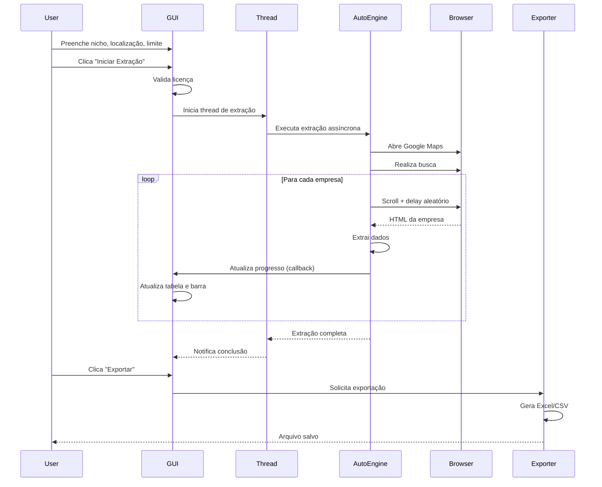

# Design Document: Google Maps Lead Extractor

## Overview

O Google Maps Lead Extractor é uma aplicação desktop comercial desenvolvida em Python que automatiza a extração de dados de empresas do Google Maps. O sistema combina uma interface gráfica moderna (CustomTkinter) com automação web robusta (Playwright) para fornecer uma solução profissional de geração de leads B2B.

### Objetivos do Design

- **Automação Confiável**: Extração de dados resiliente com proteção anti-bot e tratamento de erros
- **Interface Profissional**: GUI moderna e responsiva que mantém o usuário informado em tempo real
- **Arquitetura Desacoplada**: Separação clara entre UI, automação, licenciamento e exportação
- **Performance**: Processamento assíncrono com threading para manter a UI responsiva
- **Comercialização**: Sistema de licenciamento integrado e distribuição como executável standalone

### Tecnologias Core

- **Python 3.9+**: Linguagem base com suporte a asyncio
- **Playwright**: Automação de navegador Chromium com controle fino
- **CustomTkinter**: Framework GUI moderno com tema dark nativo
- **pandas/openpyxl**: Manipulação e exportação de dados profissional
- **threading**: Execução paralela para manter UI responsiva

## Architecture

### Visão Geral da Arquitetura

O sistema segue uma arquitetura em camadas com separação clara de responsabilidades:

```
┌─────────────────────────────────────────────────────────────┐
│                     Presentation Layer                       │
│                    (CustomTkinter GUI)                       │
│  ┌──────────────┐  ┌──────────────┐  ┌──────────────┐     │
│  │ Input Forms  │  │ Progress Bar │  │ Data Table   │     │
│  └──────────────┘  └──────────────┘  └──────────────┘     │
└─────────────────────────────────────────────────────────────┘
                            │
                            ▼
┌─────────────────────────────────────────────────────────────┐
│                    Application Layer                         │
│  ┌──────────────┐  ┌──────────────┐  ┌──────────────┐     │
│  │ GUI Manager  │  │ Thread       │  │ Event        │     │
│  │              │  │ Coordinator  │  │ Handler      │     │
│  └──────────────┘  └──────────────┘  └──────────────┘     │
└─────────────────────────────────────────────────────────────┘
                            │
                            ▼
┌─────────────────────────────────────────────────────────────┐
│                     Business Layer                           │
│  ┌──────────────┐  ┌──────────────┐  ┌──────────────┐     │
│  │ Automation   │  │ License      │  │ Data         │     │
│  │ Engine       │  │ Validator    │  │ Exporter     │     │
│  └──────────────┘  └──────────────┘  └──────────────┘     │
└─────────────────────────────────────────────────────────────┘
                            │
                            ▼
┌─────────────────────────────────────────────────────────────┐
│                    Infrastructure Layer                      │
│  ┌──────────────┐  ┌──────────────┐  ┌──────────────┐     │
│  │ Playwright   │  │ File System  │  │ Error        │     │
│  │ Browser      │  │ I/O          │  │ Logger       │     │
│  └──────────────┘  └──────────────┘  └──────────────┘     │
└─────────────────────────────────────────────────────────────┘
```

### Fluxo de Execução Principal



### Padrões Arquiteturais

1. **MVC Adaptado**: GUI (View) + GUI Manager (Controller) + Data Models (Model)
2. **Observer Pattern**: Callbacks para atualização de progresso da UI
3. **Strategy Pattern**: Diferentes estratégias de exportação (Excel vs CSV)
4. **Singleton**: License Validator e Logger compartilhados
5. **Thread-Safe Queue**: Comunicação entre thread de automação e GUI thread

## Components and Interfaces

### 1. GUI Manager (gui_manager.py)

**Responsabilidade**: Gerenciar toda a interface gráfica e coordenar interações do usuário.

**Classe Principal**: `LeadExtractorGUI`

```python
class LeadExtractorGUI:
    """
    Gerenciador da interface gráfica principal do Lead Extractor.
    Utiliza CustomTkinter para criar uma UI moderna e responsiva.
    """
    
    def __init__(self):
        """Inicializa a janela principal e todos os widgets."""
        self.root: ctk.CTk
        self.nicho_entry: ctk.CTkEntry
        self.localizacao_entry: ctk.CTkEntry
        self.limite_slider: ctk.CTkSlider
        self.progress_bar: ctk.CTkProgressBar
        self.data_table: ttk.Treeview
        self.btn_iniciar: ctk.CTkButton
        self.btn_parar: ctk.CTkButton
        self.btn_exportar: ctk.CTkButton
        self.extraction_thread: Optional[threading.Thread]
        self.stop_flag: threading.Event
        self.leads_data: List[Dict[str, str]]
        
    def criar_interface(self) -> None:
        """Cria todos os widgets da interface."""
        
    def iniciar_extracao(self) -> None:
        """Inicia a extração em thread separada."""
        
    def parar_extracao(self) -> None:
        """Sinaliza para parar a extração em andamento."""
        
    def atualizar_progresso(self, lead: Dict[str, str], progresso: float) -> None:
        """Callback para atualizar UI com novo lead e progresso."""
        
    def exportar_dados(self) -> None:
        """Abre diálogo de exportação e salva dados."""
        
    def validar_licenca(self) -> bool:
        """Valida licença antes de permitir extração."""
```

**Interface Pública**:
- `criar_interface()`: Constrói a UI completa
- `iniciar_extracao()`: Inicia processo de extração
- `parar_extracao()`: Para extração em andamento
- `atualizar_progresso(lead, progresso)`: Atualiza UI com novos dados
- `exportar_dados()`: Exporta leads coletados

**Dependências**:
- `customtkinter`: Framework GUI
- `tkinter.ttk`: Treeview para tabela de dados
- `threading`: Execução paralela
- `AutomationEngine`: Para executar extração
- `LicenseValidator`: Para validar acesso
- `DataExporter`: Para exportar dados

### 2. Automation Engine (automation_engine.py)

**Responsabilidade**: Automatizar navegação no Google Maps e extrair dados de empresas.

**Classe Principal**: `GoogleMapsAutomation`

```python
class GoogleMapsAutomation:
    """
    Motor de automação para extração de leads do Google Maps.
    Utiliza Playwright com asyncio para controle assíncrono do navegador.
    """
    
    def __init__(self, headless: bool = True):
        """Inicializa o motor de automação."""
        self.headless: bool = headless
        self.browser: Optional[Browser]
        self.page: Optional[Page]
        self.playwright: Optional[Playwright]
        
    async def inicializar_navegador(self) -> None:
        """Inicializa Playwright e abre navegador Chromium."""
        
    async def buscar_empresas(
        self, 
        nicho: str, 
        localizacao: str, 
        limite: int,
        callback: Callable[[Dict, float], None],
        stop_flag: threading.Event
    ) -> List[Dict[str, str]]:
        """
        Busca empresas no Google Maps e extrai dados.
        
        Args:
            nicho: Palavra-chave ou nicho de negócio
            localizacao: Cidade ou região
            limite: Número máximo de leads
            callback: Função para atualizar progresso na UI
            stop_flag: Flag para parar extração
            
        Returns:
            Lista de dicionários com dados das empresas
        """
        
    async def scroll_resultados(self, limite: int, stop_flag: threading.Event) -> None:
        """Realiza scroll infinito na barra lateral de resultados."""
        
    async def extrair_dados_empresa(self, elemento) -> Dict[str, str]:
        """
        Extrai dados de uma empresa específica.
        
        Returns:
            Dicionário com: nome, telefone, site, nota, comentarios, endereco
        """
        
    async def aplicar_delay_humano(self, min_sec: float = 1.0, max_sec: float = 3.0) -> None:
        """Aplica delay aleatório para simular comportamento humano."""
        
    async def fechar_navegador(self) -> None:
        """Fecha navegador e libera recursos."""
```

**Interface Pública**:
- `inicializar_navegador()`: Configura Playwright e Chromium
- `buscar_empresas(nicho, localizacao, limite, callback, stop_flag)`: Executa busca completa
- `extrair_dados_empresa(elemento)`: Extrai dados de uma empresa
- `fechar_navegador()`: Limpa recursos

**Dependências**:
- `playwright.async_api`: Automação de navegador
- `asyncio`: Programação assíncrona
- `random`: Delays aleatórios
- `typing`: Type hints

**Configurações Anti-Bot**:
- User-Agent: Mozilla/5.0 (Windows NT 10.0; Win64; x64) Chrome/120.0.0.0
- Viewport: 1920x1080
- Delays aleatórios: 1-3s entre scrolls, 2-5s ao abrir empresas
- Scroll com velocidade variável

### 3. License Validator (license_validator.py)

**Responsabilidade**: Validar licenças de uso do software.

**Classe Principal**: `LicenseValidator`

```python
class LicenseValidator:
    """
    Validador de licenças para controle de acesso comercial.
    Suporta validação por chave de API e data de expiração.
    """
    
    def __init__(self, license_file: str = "license.key"):
        """Inicializa validador com arquivo de licença."""
        self.license_file: str = license_file
        self.is_valid: bool = False
        self.expiration_date: Optional[datetime]
        self.api_key: Optional[str]
        
    def validar_licenca(self) -> Tuple[bool, str]:
        """
        Valida a licença do software.
        
        Returns:
            Tupla (is_valid, mensagem)
        """
        
    def verificar_expiracao(self) -> bool:
        """Verifica se a licença está dentro da validade."""
        
    def verificar_api_key(self) -> bool:
        """Verifica se a chave de API é válida."""
        
    def obter_status_licenca(self) -> str:
        """Retorna mensagem descritiva do status da licença."""
```

**Interface Pública**:
- `validar_licenca()`: Valida licença completa
- `obter_status_licenca()`: Retorna status legível

**Formato do Arquivo de Licença** (license.key):
```json
{
    "api_key": "GMLE-XXXX-XXXX-XXXX-XXXX",
    "expiration_date": "2025-12-31",
    "customer_name": "Nome do Cliente",
    "license_type": "commercial"
}
```

### 4. Data Exporter (data_exporter.py)

**Responsabilidade**: Exportar dados de leads em formatos profissionais.

**Classe Principal**: `DataExporter`

```python
class DataExporter:
    """
    Exportador de dados de leads para formatos Excel e CSV.
    Utiliza pandas e openpyxl para formatação profissional.
    """
    
    def __init__(self, leads_data: List[Dict[str, str]]):
        """Inicializa exportador com dados de leads."""
        self.leads_data: List[Dict[str, str]] = leads_data
        self.df: Optional[pd.DataFrame] = None
        
    def preparar_dataframe(self) -> None:
        """Converte lista de leads em DataFrame pandas."""
        
    def exportar_excel(self, filepath: str) -> bool:
        """
        Exporta dados para arquivo Excel com formatação profissional.
        
        Args:
            filepath: Caminho completo do arquivo de destino
            
        Returns:
            True se exportação foi bem-sucedida
        """
        
    def exportar_csv(self, filepath: str) -> bool:
        """
        Exporta dados para arquivo CSV.
        
        Args:
            filepath: Caminho completo do arquivo de destino
            
        Returns:
            True se exportação foi bem-sucedida
        """
        
    def formatar_excel(self, writer: pd.ExcelWriter) -> None:
        """Aplica formatação profissional ao arquivo Excel."""
```

**Interface Pública**:
- `exportar_excel(filepath)`: Exporta para Excel formatado
- `exportar_csv(filepath)`: Exporta para CSV simples

**Formatação Excel**:
- Cabeçalhos em negrito
- Largura de colunas ajustada automaticamente
- Filtros automáticos habilitados
- Congelamento da primeira linha

### 5. Error Logger (error_logger.py)

**Responsabilidade**: Registrar erros e eventos do sistema.

**Classe Principal**: `ErrorLogger`

```python
class ErrorLogger:
    """
    Sistema de logging para rastreamento de erros e eventos.
    Implementado como Singleton para uso global.
    """
    
    _instance = None
    
    def __new__(cls):
        """Implementa padrão Singleton."""
        if cls._instance is None:
            cls._instance = super().__new__(cls)
            cls._instance._inicializar_logger()
        return cls._instance
        
    def _inicializar_logger(self) -> None:
        """Configura logger com arquivo e console."""
        
    def log_erro(self, mensagem: str, exception: Optional[Exception] = None) -> None:
        """Registra erro com traceback opcional."""
        
    def log_info(self, mensagem: str) -> None:
        """Registra informação."""
        
    def log_warning(self, mensagem: str) -> None:
        """Registra aviso."""
```

**Arquivo de Log**: `lead_extractor.log`

**Formato de Log**:
```
2024-01-15 14:30:45 - INFO - Extração iniciada: nicho=restaurantes, local=São Paulo
2024-01-15 14:31:12 - ERROR - Erro ao extrair telefone: elemento não encontrado
2024-01-15 14:35:20 - INFO - Extração concluída: 50 leads extraídos
```

## Data Models

### Lead Model

```python
@dataclass
class Lead:
    """Modelo de dados para um lead extraído do Google Maps."""
    
    nome: str
    telefone: str
    site: str
    nota: str
    comentarios: str
    endereco: str
    
    def to_dict(self) -> Dict[str, str]:
        """Converte lead para dicionário."""
        return {
            "Nome": self.nome,
            "Telefone": self.telefone,
            "Site": self.site,
            "Nota": self.nota,
            "Comentários": self.comentarios,
            "Endereço": self.endereco
        }
    
    @staticmethod
    def from_dict(data: Dict[str, str]) -> 'Lead':
        """Cria Lead a partir de dicionário."""
        return Lead(
            nome=data.get("nome", "N/A"),
            telefone=data.get("telefone", "N/A"),
            site=data.get("site", "N/A"),
            nota=data.get("nota", "N/A"),
            comentarios=data.get("comentarios", "N/A"),
            endereco=data.get("endereco", "N/A")
        )
```

### Search Query Model

```python
@dataclass
class SearchQuery:
    """Modelo para parâmetros de busca."""
    
    nicho: str
    localizacao: str
    limite: int
    
    def to_google_maps_url(self) -> str:
        """Gera URL de busca do Google Maps."""
        query = f"{self.nicho} em {self.localizacao}"
        encoded_query = urllib.parse.quote(query)
        return f"https://www.google.com/maps/search/{encoded_query}"
    
    def validar(self) -> Tuple[bool, str]:
        """Valida parâmetros de busca."""
        if not self.nicho or len(self.nicho.strip()) == 0:
            return False, "Nicho não pode estar vazio"
        if not self.localizacao or len(self.localizacao.strip()) == 0:
            return False, "Localização não pode estar vazia"
        if self.limite not in [50, 100, 500]:
            return False, "Limite deve ser 50, 100 ou 500"
        return True, "Válido"
```

### Extraction State Model

```python
@dataclass
class ExtractionState:
    """Modelo para estado da extração em andamento."""
    
    is_running: bool = False
    leads_extraidos: int = 0
    total_esperado: int = 0
    tempo_inicio: Optional[datetime] = None
    tempo_fim: Optional[datetime] = None
    
    def calcular_progresso(self) -> float:
        """Calcula percentual de progresso (0.0 a 1.0)."""
        if self.total_esperado == 0:
            return 0.0
        return min(self.leads_extraidos / self.total_esperado, 1.0)
    
    def calcular_tempo_decorrido(self) -> Optional[timedelta]:
        """Calcula tempo decorrido desde o início."""
        if self.tempo_inicio is None:
            return None
        fim = self.tempo_fim if self.tempo_fim else datetime.now()
        return fim - self.tempo_inicio
```

## Seletores CSS do Google Maps

O sistema utiliza os seguintes seletores para extrair dados (sujeitos a mudanças pelo Google):

```python
GOOGLE_MAPS_SELECTORS = {
    # Barra lateral de resultados
    "results_panel": 'div[role="feed"]',
    "result_item": 'div[role="article"]',
    
    # Dados da empresa
    "nome": 'h1.DUwDvf',
    "telefone": 'button[data-item-id^="phone"]',
    "site": 'a[data-item-id="authority"]',
    "nota": 'span.MW4etd',
    "comentarios": 'span.UY7F9',
    "endereco": 'button[data-item-id^="address"]',
    
    # Navegação
    "scroll_container": 'div[role="feed"]',
    "loading_indicator": 'div.fontBodyMedium'
}
```


## Threading Architecture

### Thread Model

O sistema utiliza um modelo de threading híbrido para manter a UI responsiva:

```
Main Thread (GUI Thread)
    │
    ├─> CustomTkinter Event Loop
    │   └─> Atualização de widgets
    │
    └─> Extraction Thread (Worker)
        └─> asyncio Event Loop
            └─> Playwright Automation
                ├─> Browser Control
                ├─> Data Extraction
                └─> Callbacks para Main Thread
```

### Thread Communication

**Mecanismo**: Callbacks thread-safe usando `root.after()`

```python
def atualizar_progresso_thread_safe(self, lead: Dict, progresso: float):
    """
    Callback executado pela thread de extração.
    Usa root.after() para executar atualização na GUI thread.
    """
    self.root.after(0, lambda: self._atualizar_ui(lead, progresso))

def _atualizar_ui(self, lead: Dict, progresso: float):
    """Executa na GUI thread - seguro para modificar widgets."""
    self.progress_bar.set(progresso)
    self.data_table.insert("", "end", values=tuple(lead.values()))
    self.leads_data.append(lead)
```

### Stop Flag Pattern

```python
# Na GUI
self.stop_flag = threading.Event()

def parar_extracao(self):
    """Sinaliza para thread parar."""
    self.stop_flag.set()
    self.btn_parar.configure(state="disabled")

# Na Automation Engine
async def buscar_empresas(self, ..., stop_flag: threading.Event):
    for empresa in empresas:
        if stop_flag.is_set():
            logger.log_info("Extração interrompida pelo usuário")
            break
        # Continua extração
```

### Thread Lifecycle

1. **Início**: GUI cria thread e passa callback + stop_flag
2. **Execução**: Thread executa loop asyncio com Playwright
3. **Comunicação**: Thread chama callback via root.after() a cada lead
4. **Parada**: Stop flag é verificado em cada iteração
5. **Finalização**: Thread notifica GUI e encerra graciosamente

## Fluxo de Dados Detalhado

### 1. Fluxo de Extração

```
[Usuário] 
    ↓ (preenche formulário)
[GUI: Validação de Inputs]
    ↓ (valida nicho, localização, limite)
[GUI: Validação de Licença]
    ↓ (verifica license.key)
[GUI: Criação de Thread]
    ↓ (passa SearchQuery + callback + stop_flag)
[Extraction Thread]
    ↓ (cria asyncio event loop)
[Automation Engine: Inicializar Navegador]
    ↓ (Playwright + Chromium)
[Automation Engine: Navegar para Google Maps]
    ↓ (URL com query encoded)
[Automation Engine: Scroll Loop]
    ↓ (scroll + delay até limite ou fim)
[Automation Engine: Para cada empresa]
    ↓ (clica + extrai dados)
[Automation Engine: Criar Lead Object]
    ↓ (Lead.from_dict)
[Callback para GUI]
    ↓ (root.after)
[GUI: Atualizar Tabela + Progress Bar]
    ↓ (adiciona linha + atualiza barra)
[Automation Engine: Verificar Stop Flag]
    ↓ (continua ou para)
[Automation Engine: Fechar Navegador]
    ↓ (libera recursos)
[Thread: Notificar Conclusão]
    ↓
[GUI: Habilitar Exportação]
```

### 2. Fluxo de Exportação

```
[Usuário]
    ↓ (clica "Exportar")
[GUI: Abrir File Dialog]
    ↓ (escolhe formato e local)
[GUI: Criar DataExporter]
    ↓ (passa self.leads_data)
[DataExporter: Preparar DataFrame]
    ↓ (pandas.DataFrame)
[DataExporter: Escolher Estratégia]
    ├─> [Excel] → formatar_excel() → openpyxl
    └─> [CSV] → to_csv()
[DataExporter: Salvar Arquivo]
    ↓ (write to disk)
[GUI: Exibir Confirmação]
    ↓ (messagebox com caminho)
[Usuário]
```

### 3. Fluxo de Tratamento de Erros

```
[Qualquer Operação]
    ↓
[Try-Except Block]
    ├─> [Sucesso] → continua
    └─> [Erro]
        ↓
    [ErrorLogger.log_erro()]
        ↓
    [Verificar Tipo de Erro]
        ├─> [Erro de Conexão] → retry 3x
        ├─> [Erro de Seletor] → log + continua
        ├─> [Erro Fatal] → salva dados + encerra
        └─> [Erro de Exportação] → messagebox
```

