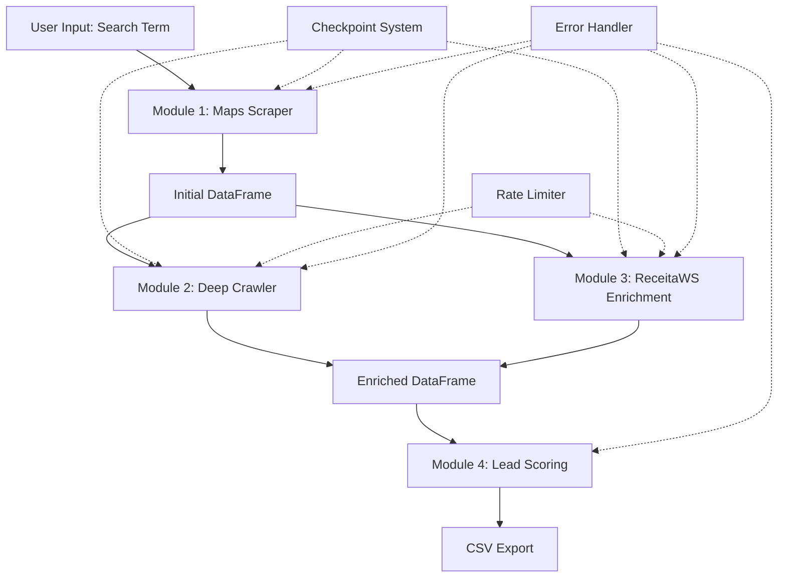

# Design Document: LeadExtract Core Scraping Engine

## Overview

The LeadExtract Core Scraping Engine is an asynchronous Python-based data extraction system designed for B2B lead generation in the Brazilian market. The system implements a four-module pipeline that collects, enriches, and scores business leads through stealth web scraping, deep crawling, government API integration, and intelligent scoring algorithms.

### System Goals

- Extract comprehensive business data from public sources without detection
- Enrich leads with financial and corporate data from Brazilian government APIs
- Score leads based on digital maturity and contact availability
- Process large volumes efficiently through asynchronous execution
- Maintain resilience against failures and rate limiting

### Key Design Principles

1. **Stealth-First Architecture**: All web interactions use anti-detection techniques (playwright-stealth, human behavior simulation, realistic delays)
2. **Async-Native Design**: Built on asyncio for concurrent processing with controlled rate limiting
3. **Fail-Safe Operations**: Comprehensive error handling ensures partial results are never lost
4. **Data Integrity**: Validation at every stage ensures clean, actionable output
5. **Resumability**: Checkpoint system allows recovery from interruptions

## Architecture

### High-Level Architecture



### Module Pipeline Flow

The system executes in a strict sequential-parallel pattern:

1. **Phase 1 (Sequential)**: Maps Scraper runs first, building the initial lead list
2. **Phase 2 (Parallel)**: Deep Crawler and ReceitaWS Enrichment run concurrently on the lead list
3. **Phase 3 (Sequential)**: Lead Scoring processes the enriched data
4. **Phase 4 (Sequential)**: CSV export generates the final output

This design maximizes throughput while respecting dependencies between modules.

### Technology Stack

- **Runtime**: Python 3.10+
- **Async Framework**: asyncio, aiohttp
- **Browser Automation**: Playwright with playwright-stealth
- **HTML Parsing**: BeautifulSoup4 with lxml parser
- **Data Processing**: pandas
- **HTTP Client**: aiohttp with connection pooling
- **Progress Tracking**: tqdm
- **Logging**: Python logging module

## Components and Interfaces

### Module 1: Maps Scraper

**Purpose**: Extract initial business data from map platforms

**Interface**:
```python
async def scrape_maps(
    search_term: str,
    max_results: Optional[int] = None,
    headless: bool = True
) -> pd.DataFrame
```

**Responsibilities**:
- Launch Playwright browser with stealth configuration
- Perform search with provided term
- Scroll page with human-like behavior (1.5-3.5s delays)
- Extract: company name, website URL, address, public phone
- Return DataFrame with columns: empresa, url_site, endereco, telefone_publico

**Key Implementation Details**:
- Viewport: 1920x1080
- User Agent: Realistic browser string
- Scroll detection: Stop after 5 consecutive attempts with no new results
- Timeout: 30 seconds per page load
- Progress logging: Every 10 companies

### Module 2: Deep Crawler

**Purpose**: Extract contact information and marketing technology stack from company websites

**Interface**:
```python
async def deep_crawl(
    df: pd.DataFrame,
    session: aiohttp.ClientSession,
    semaphore: asyncio.Semaphore
) -> pd.DataFrame
```

**Responsibilities**:
- Visit each company website using Playwright stealth mode
- Extract social media links (LinkedIn, Instagram, Facebook)
- Extract emails using regex with prioritization logic
- Extract WhatsApp numbers from multiple patterns
- Detect marketing technologies (GTM, Facebook Pixel, GA4, Facebook SDK)
- Add columns: linkedin, instagram, emails, whatsapp, tem_gtm, tem_facebook_pixel, tem_ga4, tem_facebook_sdk, stack_marketing_count

**Key Implementation Details**:
- Timeout: 20 seconds per website
- Retry strategy: Exponential backoff, max 3 attempts
- Delay between visits: 2-5 seconds (random)
- Email prioritization: Keywords (contato, comercial, vendas, rh, atendimento, suporte)
- Email exclusions: noreply@, no-reply@, postmaster@, abuse@
- Max emails per lead: 5 (semicolon-separated)
- WhatsApp normalization: +55DDNNNNNNNNN format
- Error handling: Mark with erro_crawler flag, continue processing

### Module 3: ReceitaWS Enrichment

**Purpose**: Enrich leads with financial and corporate data from Brazilian government APIs

**Interface**:
```python
async def enrich_receita(
    df: pd.DataFrame,
    session: aiohttp.ClientSession,
    semaphore: asyncio.Semaphore
) -> pd.DataFrame
```

**Responsibilities**:
- Search for CNPJ using company name
- Fetch company details: data_abertura, capital_social, QSA (partners)
- Calculate company age in years
- Extract partner names from QSA array
- Add columns: cnpj, data_abertura, idade_anos, capital_social, socios

**Key Implementation Details**:
- API: ReceitaWS public API
- Timeout: 15 seconds per request
- Rate limiting: 20 requests/minute maximum
- Delay between calls: 1-3 seconds (random)
- HTTP 429 handling: Exponential backoff (5s to 60s max)
- Error handling: Mark with erro_enriquecimento flag, continue processing
- Not found: Store empty values, continue

### Module 4: Lead Scoring

**Purpose**: Calculate lead quality score based on digital maturity and contact availability

**Interface**:
```python
def calculate_scores(df: pd.DataFrame) -> pd.DataFrame
```

**Responsibilities**:
- Calculate lead_score (0-10) using weighted criteria
- Generate score_justificativa with explanation
- Sort DataFrame by score (descending)

**Scoring Logic**:
- No marketing stack (no GTM, no Facebook Pixel): +3 points
- Company age < 1 year: +3 points
- Contact available (WhatsApp OR email): +4 points

**Score Categories**:
- 10: "Lead Premium: Sem stack de marketing, empresa nova, contato direto disponível"
- 7-9: "Lead Quente: Alta probabilidade de conversão"
- 4-6: "Lead Morno: Necessita qualificação adicional"
- 0-3: "Lead Frio: Baixa prioridade"

### Orchestration Engine

**Purpose**: Coordinate module execution with async pipeline management

**Interface**:
```python
async def main(
    search_term: str,
    max_results: Optional[int] = None,
    headless: bool = True,
    output_filename: str = "leads_enriquecidos_brutal.csv",
    enable_enrichment: bool = True
) -> None
```

**Responsibilities**:
- Validate input parameters
- Execute Phase 1: Maps Scraper (sequential)
- Execute Phase 2: Deep Crawler + ReceitaWS Enrichment (parallel via asyncio.gather)
- Execute Phase 3: Lead Scoring (sequential)
- Execute Phase 4: CSV Export (sequential)
- Manage aiohttp.ClientSession with connection pooling
- Control concurrency with semaphore (5 simultaneous connections)
- Display progress bar with tqdm
- Handle KeyboardInterrupt gracefully
- Log execution time and statistics

### Supporting Components

#### Checkpoint Manager

**Purpose**: Enable resumption of interrupted executions

**Interface**:
```python
def save_checkpoint(processed_companies: List[str], current_module: str) -> None
def load_checkpoint() -> Optional[Dict[str, Any]]
def delete_checkpoint() -> None
```

**Checkpoint Data**:
- processed_companies: List of company names already processed
- current_module: Last module that was executing
- timestamp: When checkpoint was created

**Behavior**:
- Save every 50 records
- Check age on load (< 24 hours)
- Prompt user to resume or start fresh
- Delete on successful completion

#### Rate Limiter

**Purpose**: Prevent API blocking through adaptive rate limiting

**Interface**:
```python
class RateLimiter:
    async def acquire(self) -> None
    def adjust_rate(self, response_time: float) -> None
    async def handle_429(self) -> None
```

**Strategy**:
- Token bucket algorithm
- Base limit: 20 requests/minute for ReceitaWS
- Adaptive: Increase delay by 50% when avg response time > 5s
- HTTP 429: Pause 60 seconds before retry
- Track and log rate limiting events

#### Data Validator

**Purpose**: Ensure data quality and consistency

**Interface**:
```python
def validate_lead(lead: Dict[str, Any]) -> Tuple[bool, List[str]]
```

**Validation Rules**:
- empresa: Not empty
- url_site: Starts with http:// or https:// (if not empty)
- cnpj: Exactly 14 digits (if not empty)
- emails: Contains @ and valid domain
- whatsapp: Starts with +55, has 13 digits total
- Duplicate detection: Based on empresa name

**Output**:
- dados_validos column (boolean)
- Validation error messages in logs

## Data Models

### Lead Record Structure

```python
from dataclasses import dataclass
from typing import Optional, List
from datetime import date

@dataclass
class LeadRecord:
    # Module 1: Maps Scraper
    empresa: str
    url_site: Optional[str]
    endereco: Optional[str]
    telefone_publico: Optional[str]
    
    # Module 2: Deep Crawler
    linkedin: Optional[str] = None
    instagram: Optional[str] = None
    emails: Optional[str] = None  # Semicolon-separated
    whatsapp: Optional[str] = None
    tem_gtm: bool = False
    tem_facebook_pixel: bool = False
    tem_ga4: bool = False
    tem_facebook_sdk: bool = False
    stack_marketing_count: int = 0
    erro_crawler: bool = False
    
    # Module 3: ReceitaWS Enrichment
    cnpj: Optional[str] = None
    data_abertura: Optional[date] = None
    idade_anos: Optional[int] = None
    capital_social: Optional[float] = None
    socios: Optional[str] = None  # Semicolon-separated
    erro_enriquecimento: bool = False
    
    # Module 4: Lead Scoring
    lead_score: int = 0
    score_justificativa: str = ""
    
    # Validation
    dados_validos: bool = False
```

### DataFrame Schema

The pandas DataFrame maintains the following column structure throughout the pipeline:

| Column | Type | Source Module | Description |
|--------|------|---------------|-------------|
| empresa | str | Maps Scraper | Company name |
| url_site | str | Maps Scraper | Company website URL |
| endereco | str | Maps Scraper | Public address |
| telefone_publico | str | Maps Scraper | Public phone number |
| linkedin | str | Deep Crawler | LinkedIn company page |
| instagram | str | Deep Crawler | Instagram profile |
| emails | str | Deep Crawler | Email addresses (semicolon-separated) |
| whatsapp | str | Deep Crawler | WhatsApp number (+55 format) |
| tem_gtm | bool | Deep Crawler | Has Google Tag Manager |
| tem_facebook_pixel | bool | Deep Crawler | Has Facebook Pixel |
| tem_ga4 | bool | Deep Crawler | Has Google Analytics 4 |
| tem_facebook_sdk | bool | Deep Crawler | Has Facebook SDK |
| stack_marketing_count | int | Deep Crawler | Total marketing technologies detected |
| erro_crawler | bool | Deep Crawler | Error flag for crawling failures |
| cnpj | str | ReceitaWS | Brazilian company ID (14 digits) |
| data_abertura | str | ReceitaWS | Company founding date (DD/MM/YYYY) |
| idade_anos | int | ReceitaWS | Company age in years |
| capital_social | str | ReceitaWS | Share capital (R$ format) |
| socios | str | ReceitaWS | Partner names (semicolon-separated) |
| erro_enriquecimento | bool | ReceitaWS | Error flag for enrichment failures |
| lead_score | int | Scoring | Quality score (0-10) |
| score_justificativa | str | Scoring | Score explanation |
| dados_validos | bool | Validator | Overall data validity flag |

### Configuration Constants

```python
# Browser Configuration
USER_AGENT = "Mozilla/5.0 (Windows NT 10.0; Win64; x64) AppleWebKit/537.36 (KHTML, like Gecko) Chrome/120.0.0.0 Safari/537.36"
VIEWPORT_WIDTH = 1920
VIEWPORT_HEIGHT = 1080

# Timeout Configuration
MAPS_TIMEOUT_SECONDS = 30
CRAWLER_TIMEOUT_SECONDS = 20
API_TIMEOUT_SECONDS = 15

# Retry Configuration
MAX_RETRIES = 3
BACKOFF_BASE_SECONDS = 2
BACKOFF_MAX_SECONDS = 60

# Rate Limiting
CONCURRENT_LIMIT = 5
RECEITA_MAX_REQUESTS_PER_MINUTE = 20
CRAWLER_MIN_DELAY_SECONDS = 2
CRAWLER_MAX_DELAY_SECONDS = 5
ENRICHMENT_MIN_DELAY_SECONDS = 1
ENRICHMENT_MAX_DELAY_SECONDS = 3

# Human Behavior Simulation
SCROLL_MIN_DELAY_SECONDS = 1.5
SCROLL_MAX_DELAY_SECONDS = 3.5
SCROLL_NO_RESULTS_THRESHOLD = 5

# Checkpoint Configuration
CHECKPOINT_INTERVAL = 50
CHECKPOINT_MAX_AGE_HOURS = 24

# Validation
CNPJ_LENGTH = 14
WHATSAPP_LENGTH = 13
MAX_EMAILS_PER_LEAD = 5

# Regex Patterns
EMAIL_PATTERN = r'[a-zA-Z0-9._%+-]+@[a-zA-Z0-9.-]+\.[a-zA-Z]{2,}'
WHATSAPP_PATTERNS = [
    r'wa\.me/(\+?55\d{10,11})',
    r'api\.whatsapp\.com/send\?phone=(\+?55\d{10,11})',
    r'href="tel:(\+55\d{10,11})"'
]
SOCIAL_PATTERNS = {
    'linkedin': r'linkedin\.com/company/[^/\s"]+',
    'instagram': r'instagram\.com/[^/\s"]+',
    'facebook': r'facebook\.com/[^/\s"]+'
}

# Email Prioritization
PRIORITY_EMAIL_KEYWORDS = ['contato', 'comercial', 'vendas', 'rh', 'atendimento', 'suporte']
EXCLUDED_EMAIL_PATTERNS = ['noreply@', 'no-reply@', 'postmaster@', 'abuse@']

# Marketing Stack Detection
MARKETING_STACK_SIGNATURES = {
    'gtm': 'gtm.js',
    'facebook_pixel': 'fbevents.js',
    'ga4': 'googletagmanager.com/gtag/js',
    'facebook_sdk': 'connect.facebook.net'
}
```

