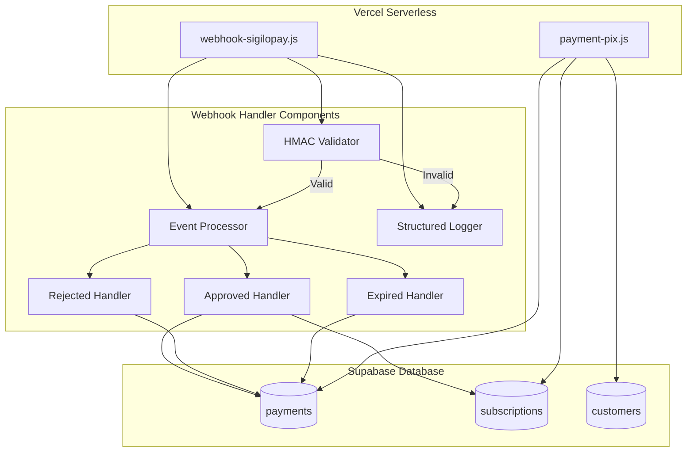
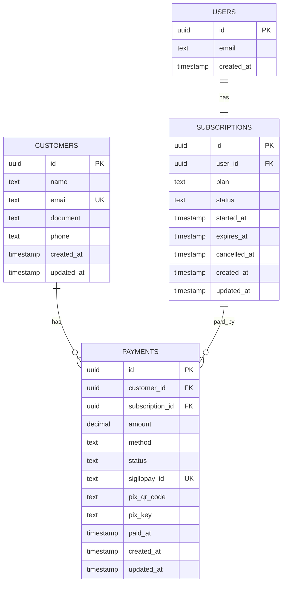

# Design Document: SigiloPay Webhook Integration

## Overview

Este documento descreve o design técnico para implementação do sistema de webhook do SigiloPay no LeadExtract. O sistema automatiza a ativação de assinaturas após confirmação de pagamento PIX, substituindo o comportamento atual onde assinaturas são ativadas imediatamente ao gerar o QR Code PIX.

### Objetivos

1. Receber notificações HTTP POST do SigiloPay quando pagamentos forem confirmados
2. Validar autenticidade das notificações usando assinatura HMAC-SHA256
3. Atualizar status de assinaturas de 'pending' para 'active' após confirmação de pagamento
4. Registrar todas as transações para auditoria e troubleshooting
5. Garantir idempotência para lidar com reenvios de webhook
6. Implementar como Vercel Serverless Function para escalabilidade

### Escopo

**Incluído:**
- Endpoint serverless `/api/webhook-sigilopay` para receber notificações
- Validação de assinatura HMAC usando secret key do SigiloPay
- Processamento de eventos: payment.approved, payment.rejected, payment.expired, payment.pending
- Atualização automática de status de assinaturas e pagamentos
- Sistema de logs estruturado para auditoria
- Modificações no schema do banco de dados (tabelas payments e subscriptions)
- Modificação no fluxo de checkout para criar assinaturas com status 'pending'

**Excluído:**
- Interface administrativa para visualizar webhooks recebidos
- Sistema de retry automático para webhooks falhados (responsabilidade do SigiloPay)
- Notificações por email para usuários sobre status de pagamento
- Dashboard de métricas de pagamentos

### Decisões de Design

1. **Serverless Architecture**: Uso de Vercel Serverless Functions para eliminar necessidade de gerenciar servidores e garantir escalabilidade automática
2. **HMAC Validation**: Validação obrigatória de assinatura HMAC para prevenir webhooks maliciosos
3. **Idempotency**: Verificação de status antes de atualizar para evitar efeitos colaterais de notificações duplicadas
4. **Service Role Key**: Uso de service_role_key do Supabase para bypass de RLS policies, necessário para operações administrativas
5. **Atomic Operations**: Uso de transações do banco de dados para garantir consistência
6. **Structured Logging**: Logs estruturados com níveis apropriados (INFO, WARN, ERROR) para facilitar debugging

## Architecture

### System Context

```mermaid
graph TB
    User[Usuário] -->|1. Inicia checkout| Frontend[Frontend LeadExtract]
    Frontend -->|2. Cria pagamento PIX| PaymentAPI[/api/payment-pix]
    PaymentAPI -->|3. Solicita QR Code| SigiloPay[SigiloPay Gateway]
    PaymentAPI -->|4. Cria subscription pending| Supabase[(Supabase DB)]
    SigiloPay -->|5. Retorna QR Code| PaymentAPI
    PaymentAPI -->|6. Retorna QR Code| Frontend
    Frontend -->|7. Exibe QR Code| User
    User -->|8. Paga via PIX| BankApp[App Bancário]
    BankApp -->|9. Confirma pagamento| SigiloPay
    SigiloPay -->|10. Envia webhook| WebhookHandler[/api/webhook-sigilopay]
    WebhookHandler -->|11. Valida HMAC| WebhookHandler
    WebhookHandler -->|12. Ativa subscription| Supabase
    WebhookHandler -->|13. Retorna 200 OK| SigiloPay
```

### Component Architecture



### Data Flow

**Fluxo de Checkout (Modificado):**

1. Usuário seleciona plano e inicia checkout
2. Frontend chama `/api/payment-pix` com dados do cliente e plano
3. API cria registro em `customers` (se não existir)
4. API cria registro em `subscriptions` com status='pending'
5. API cria registro em `payments` com status='pending' e subscription_id
6. API chama SigiloPay para gerar QR Code PIX
7. API armazena transaction_id do SigiloPay no payment
8. API retorna QR Code para frontend
9. Frontend exibe QR Code para usuário

**Fluxo de Webhook (Novo):**

1. SigiloPay detecta confirmação de pagamento PIX
2. SigiloPay envia HTTP POST para `/api/webhook-sigilopay`
3. Webhook extrai assinatura HMAC do header `x-sigilopay-signature`
4. Webhook calcula HMAC-SHA256 do payload usando secret key
5. Webhook compara assinaturas usando comparação segura
6. Se válido, webhook extrai `transactionId` do payload
7. Webhook busca payment pelo `sigilopay_id = transactionId`
8. Webhook verifica se payment já está 'approved' (idempotência)
9. Se não aprovado, webhook atualiza payment.status = 'approved'
10. Webhook busca subscription pelo payment.subscription_id
11. Se subscription.status = 'pending', atualiza para 'active'
12. Webhook define subscription.started_at = NOW()
13. Webhook retorna 200 OK para SigiloPay

## Components and Interfaces

### Webhook Handler Module

**File:** `/api/webhook-sigilopay.js`

**Responsibilities:**
- Receber requisições HTTP POST do SigiloPay
- Validar método HTTP (apenas POST)
- Extrair e validar assinatura HMAC
- Rotear eventos para handlers apropriados
- Retornar respostas HTTP apropriadas
- Registrar logs estruturados

**Interface:**

```javascript
/**
 * Vercel Serverless Function Handler
 * @param {VercelRequest} req - Requisição HTTP
 * @param {VercelResponse} res - Resposta HTTP
 */
module.exports = async (req, res) => {
  // Implementation
}
```

**Request Format:**

```http
POST /api/webhook-sigilopay HTTP/1.1
Host: leadextract.com
Content-Type: application/json
x-sigilopay-signature: <hmac-sha256-signature>

{
  "event": "payment.approved",
  "transactionId": "txn_abc123xyz",
  "status": "approved",
  "amount": 97.00,
  "customer": {
    "name": "João Silva",
    "email": "joao@example.com",
    "document": "12345678900"
  },
  "paidAt": "2024-01-15T10:30:00Z"
}
```

**Response Format:**

```json
{
  "success": true,
  "message": "Webhook processed successfully",
  "subscriptionId": "uuid-here",
  "subscriptionStatus": "active"
}
```

### HMAC Validator

**Responsibilities:**
- Extrair assinatura do header `x-sigilopay-signature`
- Calcular HMAC-SHA256 do payload JSON
- Comparar assinaturas usando `crypto.timingSafeEqual`
- Retornar resultado da validação

**Interface:**

```javascript
/**
 * Valida assinatura HMAC do webhook
 * @param {string} signature - Assinatura recebida no header
 * @param {string} payload - Payload JSON como string
 * @param {string} secretKey - Secret key do SigiloPay
 * @returns {boolean} - True se assinatura é válida
 */
function validateHMAC(signature, payload, secretKey) {
  const crypto = require('crypto');
  const expectedSignature = crypto
    .createHmac('sha256', secretKey)
    .update(payload)
    .digest('hex');
  
  return crypto.timingSafeEqual(
    Buffer.from(signature),
    Buffer.from(expectedSignature)
  );
}
```

### Event Processor

**Responsibilities:**
- Rotear eventos para handlers específicos
- Coordenar operações de banco de dados
- Garantir idempotência
- Gerenciar transações

**Interface:**

```javascript
/**
 * Processa evento de webhook
 * @param {Object} payload - Payload do webhook
 * @param {Object} supabase - Cliente Supabase
 * @returns {Promise<Object>} - Resultado do processamento
 */
async function processEvent(payload, supabase) {
  const { event, transactionId } = payload;
  
  switch (event) {
    case 'payment.approved':
      return await handlePaymentApproved(payload, supabase);
    case 'payment.rejected':
      return await handlePaymentRejected(payload, supabase);
    case 'payment.expired':
      return await handlePaymentExpired(payload, supabase);
    case 'payment.pending':
      return await handlePaymentPending(payload, supabase);
    default:
      throw new Error(`Unknown event type: ${event}`);
  }
}
```

### Payment Approved Handler

**Responsibilities:**
- Buscar payment pelo transaction_id
- Verificar se já está aprovado (idempotência)
- Atualizar payment.status = 'approved'
- Atualizar payment.paid_at
- Buscar subscription associada
- Ativar subscription se status = 'pending'

**Interface:**

```javascript
/**
 * Processa evento payment.approved
 * @param {Object} payload - Payload do webhook
 * @param {Object} supabase - Cliente Supabase
 * @returns {Promise<Object>} - Resultado com subscription ativada
 */
async function handlePaymentApproved(payload, supabase) {
  const { transactionId, paidAt, amount } = payload;
  
  // 1. Buscar payment
  const { data: payment, error: paymentError } = await supabase
    .from('payments')
    .select('*, subscription_id')
    .eq('sigilopay_id', transactionId)
    .single();
  
  if (paymentError || !payment) {
    throw new Error(`Payment not found: ${transactionId}`);
  }
  
  // 2. Verificar idempotência
  if (payment.status === 'approved') {
    return { alreadyProcessed: true, payment };
  }
  
  // 3. Atualizar payment
  await supabase
    .from('payments')
    .update({
      status: 'approved',
      paid_at: paidAt,
      updated_at: new Date().toISOString()
    })
    .eq('id', payment.id);
  
  // 4. Ativar subscription
  if (payment.subscription_id) {
    const { data: subscription } = await supabase
      .from('subscriptions')
      .select('*')
      .eq('id', payment.subscription_id)
      .single();
    
    if (subscription && subscription.status === 'pending') {
      await supabase
        .from('subscriptions')
        .update({
          status: 'active',
          started_at: new Date().toISOString(),
          updated_at: new Date().toISOString()
        })
        .eq('id', subscription.id);
      
      return { subscriptionActivated: true, subscription };
    }
  }
  
  return { paymentUpdated: true, payment };
}
```

### Structured Logger

**Responsibilities:**
- Registrar eventos com níveis apropriados
- Incluir contexto relevante (transaction_id, user_id)
- Formatar logs para facilitar parsing
- Registrar tentativas de validação falhadas

**Interface:**

```javascript
/**
 * Logger estruturado
 */
const logger = {
  info: (message, context = {}) => {
    console.log(JSON.stringify({
      level: 'INFO',
      timestamp: new Date().toISOString(),
      message,
      ...context
    }));
  },
  
  warn: (message, context = {}) => {
    console.warn(JSON.stringify({
      level: 'WARN',
      timestamp: new Date().toISOString(),
      message,
      ...context
    }));
  },
  
  error: (message, error, context = {}) => {
    console.error(JSON.stringify({
      level: 'ERROR',
      timestamp: new Date().toISOString(),
      message,
      error: error.message,
      stack: error.stack,
      ...context
    }));
  }
};
```

## Data Models

### Database Schema Changes

**Tabela: payments (Nova)**

```sql
CREATE TABLE IF NOT EXISTS payments (
  id UUID DEFAULT gen_random_uuid() PRIMARY KEY,
  customer_id UUID REFERENCES customers(id) ON DELETE SET NULL,
  subscription_id UUID REFERENCES subscriptions(id) ON DELETE SET NULL,
  amount DECIMAL(10, 2) NOT NULL,
  method TEXT NOT NULL CHECK (method IN ('pix', 'credit_card', 'boleto')),
  status TEXT NOT NULL DEFAULT 'pending' CHECK (status IN ('pending', 'approved', 'failed', 'cancelled')),
  sigilopay_id TEXT UNIQUE,
  pix_qr_code TEXT,
  pix_key TEXT,
  paid_at TIMESTAMP WITH TIME ZONE,
  created_at TIMESTAMP WITH TIME ZONE DEFAULT NOW(),
  updated_at TIMESTAMP WITH TIME ZONE DEFAULT NOW()
);

CREATE INDEX IF NOT EXISTS idx_payments_customer_id ON payments(customer_id);
CREATE INDEX IF NOT EXISTS idx_payments_subscription_id ON payments(subscription_id);
CREATE INDEX IF NOT EXISTS idx_payments_sigilopay_id ON payments(sigilopay_id);
CREATE INDEX IF NOT EXISTS idx_payments_status ON payments(status);
```

**Tabela: subscriptions (Modificada)**

```sql
-- Já existe, mas garantir que status 'pending' está no CHECK constraint
ALTER TABLE subscriptions 
  DROP CONSTRAINT IF EXISTS subscriptions_status_check;

ALTER TABLE subscriptions 
  ADD CONSTRAINT subscriptions_status_check 
  CHECK (status IN ('active', 'expired', 'cancelled', 'pending'));

-- Garantir que started_at pode ser NULL para subscriptions pending
ALTER TABLE subscriptions 
  ALTER COLUMN started_at DROP NOT NULL;
```

**Tabela: customers (Nova)**

```sql
CREATE TABLE IF NOT EXISTS customers (
  id UUID DEFAULT gen_random_uuid() PRIMARY KEY,
  name TEXT NOT NULL,
  email TEXT NOT NULL UNIQUE,
  document TEXT NOT NULL,
  phone TEXT,
  created_at TIMESTAMP WITH TIME ZONE DEFAULT NOW(),
  updated_at TIMESTAMP WITH TIME ZONE DEFAULT NOW()
);

CREATE INDEX IF NOT EXISTS idx_customers_email ON customers(email);
CREATE INDEX IF NOT EXISTS idx_customers_document ON customers(document);
```

### Entity Relationships



### Data Types

**WebhookPayload:**

```typescript
interface WebhookPayload {
  event: 'payment.approved' | 'payment.rejected' | 'payment.expired' | 'payment.pending';
  transactionId: string;
  status: 'approved' | 'rejected' | 'expired' | 'pending';
  amount: number;
  customer: {
    name: string;
    email: string;
    document: string;
  };
  paidAt?: string; // ISO 8601 timestamp
}
```

**Payment:**

```typescript
interface Payment {
  id: string; // UUID
  customer_id: string | null; // UUID
  subscription_id: string | null; // UUID
  amount: number; // Decimal
  method: 'pix' | 'credit_card' | 'boleto';
  status: 'pending' | 'approved' | 'failed' | 'cancelled';
  sigilopay_id: string | null;
  pix_qr_code: string | null;
  pix_key: string | null;
  paid_at: string | null; // ISO 8601 timestamp
  created_at: string; // ISO 8601 timestamp
  updated_at: string; // ISO 8601 timestamp
}
```

**Subscription:**

```typescript
interface Subscription {
  id: string; // UUID
  user_id: string; // UUID
  plan: 'standard' | 'premium';
  status: 'active' | 'expired' | 'cancelled' | 'pending';
  started_at: string | null; // ISO 8601 timestamp
  expires_at: string | null; // ISO 8601 timestamp
  cancelled_at: string | null; // ISO 8601 timestamp
  created_at: string; // ISO 8601 timestamp
  updated_at: string; // ISO 8601 timestamp
}
```

**Customer:**

```typescript
interface Customer {
  id: string; // UUID
  name: string;
  email: string;
  document: string;
  phone: string | null;
  created_at: string; // ISO 8601 timestamp
  updated_at: string; // ISO 8601 timestamp
}
```


## Correctness Properties

*A property is a characteristic or behavior that should hold true across all valid executions of a system-essentially, a formal statement about what the system should do. Properties serve as the bridge between human-readable specifications and machine-verifiable correctness guarantees.*

### Property Reflection

Após análise do prework, identifiquei as seguintes redundâncias e consolidações:

**Redundâncias Identificadas:**
- Propriedades 4.8 e 4.9 (expires_at NULL para premium e standard) podem ser combinadas em uma única propriedade sobre planos vitalícios
- Propriedades 4.3 e 4.4 (atualizar status e paid_at) podem ser combinadas em uma propriedade sobre atualização completa de payment
- Propriedades 3.2 e 3.3 (calcular HMAC e comparar) podem ser combinadas em uma propriedade sobre validação HMAC completa
- Propriedades 6.1 e 6.2 (verificar status approved e não modificar) podem ser combinadas em uma propriedade de idempotência

**Propriedades Consolidadas:**
Após eliminação de redundâncias, mantemos as propriedades que fornecem valor único de validação.

### Property 1: Subscriptions criadas no checkout têm status pending

*Para qualquer* assinatura criada através do fluxo de checkout, o status inicial deve ser 'pending' até que o pagamento seja confirmado via webhook.

**Validates: Requirements 1.1**

### Property 2: Payments incluem transaction ID do SigiloPay

*Para qualquer* pagamento PIX criado, o campo sigilopay_id deve estar presente e não ser nulo, contendo o transaction ID retornado pelo SigiloPay.

**Validates: Requirements 1.2**

### Property 3: Payment relaciona subscription com user

*Para qualquer* payment criado no checkout, deve existir um subscription_id que referencia uma subscription válida, que por sua vez tem um user_id válido.

**Validates: Requirements 1.3, 11.2**

### Property 4: API retorna QR Code e código PIX

*Para qualquer* requisição bem-sucedida de criação de pagamento PIX, a resposta deve conter os campos pix_qr_code e pix_key não nulos.

**Validates: Requirements 1.4**

### Property 5: Subscription permanece pending até webhook

*Para qualquer* subscription criada com status 'pending', o status não deve mudar para 'active' até que um webhook payment.approved seja processado com sucesso.

**Validates: Requirements 1.5**

### Property 6: Webhook aceita apenas método POST

*Para qualquer* método HTTP diferente de POST (GET, PUT, DELETE, PATCH, etc.), o webhook deve retornar status 405 Method Not Allowed.

**Validates: Requirements 2.4**

### Property 7: Webhook valida schema do payload

*Para qualquer* payload recebido pelo webhook, se contém todos os campos obrigatórios (event, transactionId, status, amount, customer), deve ser aceito; caso contrário, deve retornar 400 Bad Request.

**Validates: Requirements 2.3, 2.6**

### Property 8: Validação HMAC rejeita assinaturas inválidas

*Para qualquer* payload recebido, se a assinatura HMAC calculada usando a secret key não corresponder à assinatura no header x-sigilopay-signature, o webhook deve retornar 401 Unauthorized.

**Validates: Requirements 3.2, 3.3, 3.4**

### Property 9: Payment.approved atualiza payment e subscription

*Para qualquer* evento payment.approved com transaction ID válido, o payment correspondente deve ter status atualizado para 'approved', paid_at preenchido, e a subscription associada deve ter status atualizado para 'active' com started_at definido.

**Validates: Requirements 4.1, 4.3, 4.4, 4.5, 4.6, 4.7**

### Property 10: Planos vitalícios têm expires_at NULL

*Para qualquer* subscription ativada com plano 'premium' ou 'standard', o campo expires_at deve ser NULL, indicando que a assinatura é vitalícia.

**Validates: Requirements 4.8, 4.9**

### Property 11: Webhook retorna 200 OK para processamento bem-sucedido

*Para qualquer* evento de webhook processado com sucesso (payment encontrado, validações passadas, dados atualizados), o webhook deve retornar status 200 OK com mensagem de sucesso.

**Validates: Requirements 4.10, 5.6**

### Property 12: Payment.rejected atualiza status para failed

*Para qualquer* evento payment.rejected com transaction ID válido, o payment correspondente deve ter status atualizado para 'failed' e a subscription deve permanecer com status 'pending'.

**Validates: Requirements 5.1, 5.4**

### Property 13: Payment.expired atualiza status para cancelled

*Para qualquer* evento payment.expired com transaction ID válido, o payment correspondente deve ter status atualizado para 'cancelled' e a subscription deve permanecer com status 'pending'.

**Validates: Requirements 5.2, 5.4**

### Property 14: Payment.pending mantém status pending

*Para qualquer* evento payment.pending com transaction ID válido, o payment correspondente deve manter status 'pending' sem alterações.

**Validates: Requirements 5.3**

### Property 15: Idempotência de payment.approved

*Para qualquer* payment já aprovado (status = 'approved'), processar novamente um evento payment.approved para o mesmo transaction ID deve retornar 200 OK sem modificar dados no banco de dados.

**Validates: Requirements 6.1, 6.2**

### Property 16: Múltiplas notificações ativam subscription apenas uma vez

*Para qualquer* sequência de múltiplas notificações payment.approved idênticas, a subscription deve ser ativada apenas uma vez, com started_at definido na primeira ativação e não modificado nas subsequentes.

**Validates: Requirements 6.4**

### Property 17: Exceções não tratadas retornam 500

*Para qualquer* exceção não tratada que ocorra durante o processamento do webhook, o handler deve retornar status 500 Internal Server Error com mensagem de erro.

**Validates: Requirements 8.4**

### Property 18: Resiliência a reenvios após falha

*Para qualquer* webhook que falhe com erro 5xx e seja reenviado pelo SigiloPay, o processamento subsequente deve ser bem-sucedido se as condições de erro forem resolvidas.

**Validates: Requirements 8.6**

### Property 19: Validação de variáveis de ambiente

*Para qualquer* conjunto de variáveis de ambiente fornecidas, se todas as variáveis obrigatórias (SIGILOPAY_SECRET_KEY, SUPABASE_SERVICE_ROLE_KEY, VITE_SUPABASE_URL) estiverem presentes e válidas, o webhook deve inicializar com sucesso; caso contrário, deve falhar com erro descritivo.

**Validates: Requirements 9.6**

### Property 20: Webhook usa subscription_id para localizar subscription

*Para qualquer* payment com subscription_id não nulo, o webhook deve usar esse subscription_id para localizar e atualizar a subscription correspondente, não o customer_id.

**Validates: Requirements 11.3**

### Property 21: Integridade referencial de subscription_id

*Para qualquer* subscription deletada, todos os payments que referenciam essa subscription devem ter subscription_id definido como NULL automaticamente (ON DELETE SET NULL).

**Validates: Requirements 11.6**

## Error Handling

### Error Categories

**1. Validation Errors (4xx)**

- **400 Bad Request**: Payload malformado ou campos obrigatórios ausentes
  - Missing fields: event, transactionId, status, amount, customer
  - Invalid JSON format
  - Invalid data types
  
- **401 Unauthorized**: Falha na validação HMAC
  - Missing x-sigilopay-signature header
  - Invalid HMAC signature
  - Expired signature (se implementado)
  
- **404 Not Found**: Recurso não encontrado
  - Transaction ID não corresponde a nenhum payment
  - Payment sem subscription_id associado
  
- **405 Method Not Allowed**: Método HTTP inválido
  - Qualquer método diferente de POST

**2. Server Errors (5xx)**

- **500 Internal Server Error**: Exceções não tratadas
  - Erros de lógica de negócio
  - Falhas inesperadas no código
  
- **503 Service Unavailable**: Serviços externos indisponíveis
  - Supabase database down
  - Connection pool exhausted
  
- **504 Gateway Timeout**: Timeout em operações
  - Timeout na conexão com Supabase
  - Queries lentas no banco de dados

### Error Response Format

```json
{
  "success": false,
  "error": {
    "code": "INVALID_SIGNATURE",
    "message": "HMAC signature validation failed",
    "transactionId": "txn_abc123xyz",
    "timestamp": "2024-01-15T10:30:00Z"
  }
}
```

### Error Handling Strategy

**Retry Logic:**
- O webhook NÃO implementa retry automático
- Responsabilidade do SigiloPay reenviar webhooks em caso de erro 5xx
- Idempotência garante que reenvios não causam efeitos colaterais

**Logging:**
- Todos os erros são registrados com nível ERROR
- Contexto completo incluído: transactionId, payload, stack trace
- Falhas de validação HMAC registradas com nível WARN e IP de origem

**Graceful Degradation:**
- Falhas em logging não devem impedir processamento do webhook
- Falhas em operações não-críticas (ex: atualizar timestamps) não devem causar rollback

**Transaction Management:**
- Operações de banco de dados são atômicas
- Rollback automático em caso de erro
- Garantia de consistência entre payment e subscription

### Error Recovery

**Database Unavailable:**
```javascript
try {
  // Database operations
} catch (error) {
  if (error.code === 'ECONNREFUSED' || error.code === 'ETIMEDOUT') {
    logger.error('Database unavailable', error, { transactionId });
    return res.status(503).json({
      success: false,
      error: {
        code: 'DATABASE_UNAVAILABLE',
        message: 'Database temporarily unavailable, please retry',
        transactionId
      }
    });
  }
  throw error;
}
```

**Payment Not Found:**
```javascript
if (!payment) {
  logger.warn('Payment not found', { transactionId });
  return res.status(404).json({
    success: false,
    error: {
      code: 'PAYMENT_NOT_FOUND',
      message: `No payment found for transaction ${transactionId}`,
      transactionId
    }
  });
}
```

**HMAC Validation Failed:**
```javascript
if (!isValidSignature) {
  logger.warn('HMAC validation failed', {
    transactionId,
    ip: req.headers['x-forwarded-for'] || req.connection.remoteAddress,
    timestamp: new Date().toISOString()
  });
  return res.status(401).json({
    success: false,
    error: {
      code: 'INVALID_SIGNATURE',
      message: 'HMAC signature validation failed',
      transactionId
    }
  });
}
```

## Testing Strategy

### Dual Testing Approach

Este projeto utilizará uma abordagem dual de testes, combinando unit tests e property-based tests para garantir cobertura abrangente:

**Unit Tests:**
- Casos específicos de exemplo
- Edge cases e condições de erro
- Integração entre componentes
- Cenários de configuração específicos

**Property-Based Tests:**
- Propriedades universais que devem valer para todos os inputs
- Geração automática de casos de teste
- Validação de invariantes do sistema
- Testes de idempotência e resiliência

### Property-Based Testing Configuration

**Framework:** fast-check (JavaScript/Node.js)

**Configuração:**
- Mínimo 100 iterações por teste de propriedade
- Seed aleatória para reprodutibilidade
- Shrinking automático para encontrar casos mínimos de falha

**Tag Format:**
Cada teste de propriedade deve incluir comentário referenciando a propriedade do design:

```javascript
// Feature: sigilopay-webhook-integration, Property 1: Subscriptions criadas no checkout têm status pending
test('subscriptions created in checkout have pending status', async () => {
  await fc.assert(
    fc.asyncProperty(
      fc.record({
        userId: fc.uuid(),
        plan: fc.constantFrom('standard', 'premium'),
        amount: fc.double({ min: 1, max: 1000 })
      }),
      async (checkoutData) => {
        const subscription = await createSubscriptionInCheckout(checkoutData);
        expect(subscription.status).toBe('pending');
      }
    ),
    { numRuns: 100 }
  );
});
```

### Unit Test Coverage

**Webhook Handler:**
- ✓ Aceita requisições POST válidas
- ✓ Rejeita métodos HTTP não-POST com 405
- ✓ Valida presença de campos obrigatórios
- ✓ Retorna 400 para payload malformado
- ✓ Retorna 401 para assinatura HMAC inválida
- ✓ Retorna 401 quando header x-sigilopay-signature está ausente
- ✓ Retorna 404 quando transaction ID não existe
- ✓ Retorna 503 quando banco de dados está indisponível
- ✓ Retorna 504 quando ocorre timeout
- ✓ Retorna 500 para exceções não tratadas

**HMAC Validator:**
- ✓ Calcula HMAC-SHA256 corretamente
- ✓ Valida assinaturas corretas
- ✓ Rejeita assinaturas incorretas
- ✓ Usa comparação timing-safe

**Event Processor:**
- ✓ Roteia payment.approved corretamente
- ✓ Roteia payment.rejected corretamente
- ✓ Roteia payment.expired corretamente
- ✓ Roteia payment.pending corretamente
- ✓ Lança erro para eventos desconhecidos

**Payment Approved Handler:**
- ✓ Busca payment por transaction ID
- ✓ Atualiza payment status para 'approved'
- ✓ Registra paid_at timestamp
- ✓ Busca subscription por subscription_id
- ✓ Ativa subscription se status = 'pending'
- ✓ Define started_at ao ativar
- ✓ Mantém expires_at NULL para planos vitalícios
- ✓ Não modifica subscription já ativa (idempotência)

**Checkout Flow:**
- ✓ Cria subscription com status 'pending'
- ✓ Cria payment com subscription_id
- ✓ Armazena transaction ID do SigiloPay
- ✓ Retorna QR Code e código PIX

### Property-Based Test Coverage

**Property 1: Subscriptions criadas no checkout têm status pending**
- Gerar: userId aleatório, plano aleatório (standard/premium), amount aleatório
- Verificar: subscription.status === 'pending'

**Property 2: Payments incluem transaction ID do SigiloPay**
- Gerar: dados de checkout aleatórios
- Verificar: payment.sigilopay_id !== null && payment.sigilopay_id !== undefined

**Property 3: Payment relaciona subscription com user**
- Gerar: dados de checkout aleatórios
- Verificar: payment.subscription_id existe e subscription.user_id existe

**Property 6: Webhook aceita apenas método POST**
- Gerar: métodos HTTP aleatórios exceto POST
- Verificar: response.status === 405

**Property 7: Webhook valida schema do payload**
- Gerar: payloads com campos obrigatórios presentes/ausentes
- Verificar: campos presentes → aceito, campos ausentes → 400

**Property 8: Validação HMAC rejeita assinaturas inválidas**
- Gerar: payloads aleatórios, assinaturas válidas/inválidas
- Verificar: assinatura válida → aceito, inválida → 401

**Property 9: Payment.approved atualiza payment e subscription**
- Gerar: eventos payment.approved aleatórios com transaction IDs válidos
- Verificar: payment.status === 'approved' && subscription.status === 'active'

**Property 15: Idempotência de payment.approved**
- Gerar: eventos payment.approved aleatórios
- Processar: duas vezes o mesmo evento
- Verificar: segunda execução não modifica dados

**Property 16: Múltiplas notificações ativam subscription apenas uma vez**
- Gerar: N notificações idênticas (N aleatório entre 2 e 10)
- Processar: todas as notificações
- Verificar: subscription.started_at não muda após primeira ativação

### Integration Tests

**End-to-End Flow:**
1. Criar usuário no Supabase Auth
2. Iniciar checkout com plano premium
3. Verificar subscription criada com status 'pending'
4. Simular webhook payment.approved
5. Verificar subscription ativada com status 'active'
6. Verificar payment atualizado para 'approved'

**Database Integrity:**
1. Criar subscription e payment
2. Deletar subscription
3. Verificar payment.subscription_id = NULL (ON DELETE SET NULL)

**HMAC Security:**
1. Enviar webhook com assinatura válida → aceito
2. Enviar webhook com assinatura inválida → rejeitado
3. Enviar webhook sem header de assinatura → rejeitado
4. Enviar webhook com secret key incorreta → rejeitado

### Test Data Generators

**Arbitrary Subscription:**
```javascript
const arbSubscription = fc.record({
  id: fc.uuid(),
  user_id: fc.uuid(),
  plan: fc.constantFrom('standard', 'premium'),
  status: fc.constantFrom('active', 'expired', 'cancelled', 'pending'),
  started_at: fc.option(fc.date(), { nil: null }),
  expires_at: fc.constant(null), // Vitalício
  created_at: fc.date(),
  updated_at: fc.date()
});
```

**Arbitrary Payment:**
```javascript
const arbPayment = fc.record({
  id: fc.uuid(),
  customer_id: fc.uuid(),
  subscription_id: fc.option(fc.uuid(), { nil: null }),
  amount: fc.double({ min: 1, max: 1000, noNaN: true }),
  method: fc.constant('pix'),
  status: fc.constantFrom('pending', 'approved', 'failed', 'cancelled'),
  sigilopay_id: fc.string({ minLength: 10, maxLength: 50 }),
  pix_qr_code: fc.string(),
  pix_key: fc.string(),
  paid_at: fc.option(fc.date(), { nil: null }),
  created_at: fc.date(),
  updated_at: fc.date()
});
```

**Arbitrary Webhook Payload:**
```javascript
const arbWebhookPayload = fc.record({
  event: fc.constantFrom('payment.approved', 'payment.rejected', 'payment.expired', 'payment.pending'),
  transactionId: fc.string({ minLength: 10, maxLength: 50 }),
  status: fc.constantFrom('approved', 'rejected', 'expired', 'pending'),
  amount: fc.double({ min: 1, max: 1000, noNaN: true }),
  customer: fc.record({
    name: fc.string({ minLength: 3, maxLength: 100 }),
    email: fc.emailAddress(),
    document: fc.string({ minLength: 11, maxLength: 14 })
  }),
  paidAt: fc.option(fc.date().map(d => d.toISOString()), { nil: undefined })
});
```

### Test Environment

**Local Development:**
- Supabase local instance usando Docker
- Mock do SigiloPay API para testes de integração
- Variáveis de ambiente de teste em `.env.test`

**CI/CD:**
- GitHub Actions para execução automática de testes
- Supabase staging instance para testes de integração
- Cobertura de código mínima: 80%

**Test Database:**
- Schema idêntico ao production
- Dados de seed para testes consistentes
- Limpeza automática entre testes

### Mocking Strategy

**SigiloPay API:**
```javascript
const mockSigiloPay = {
  createPixPayment: jest.fn().mockResolvedValue({
    id: 'txn_mock123',
    qr_code: 'mock_qr_code_base64',
    pix_key: '00020126580014br.gov.bcb.pix...',
    amount: 97.00
  }),
  
  sendWebhook: jest.fn().mockImplementation((url, payload, signature) => {
    return axios.post(url, payload, {
      headers: { 'x-sigilopay-signature': signature }
    });
  })
};
```

**Supabase Client:**
```javascript
const mockSupabase = {
  from: jest.fn().mockReturnThis(),
  select: jest.fn().mockReturnThis(),
  insert: jest.fn().mockReturnThis(),
  update: jest.fn().mockReturnThis(),
  eq: jest.fn().mockReturnThis(),
  single: jest.fn().mockResolvedValue({ data: mockData, error: null })
};
```

### Performance Testing

**Load Testing:**
- Simular 100 webhooks simultâneos
- Verificar tempo de resposta < 500ms (p95)
- Verificar sem erros de concorrência

**Stress Testing:**
- Simular 1000 webhooks em 1 minuto
- Verificar comportamento sob carga
- Verificar recuperação após pico

**Idempotency Testing:**
- Enviar mesmo webhook 1000 vezes
- Verificar apenas uma ativação de subscription
- Verificar todas as respostas são 200 OK

