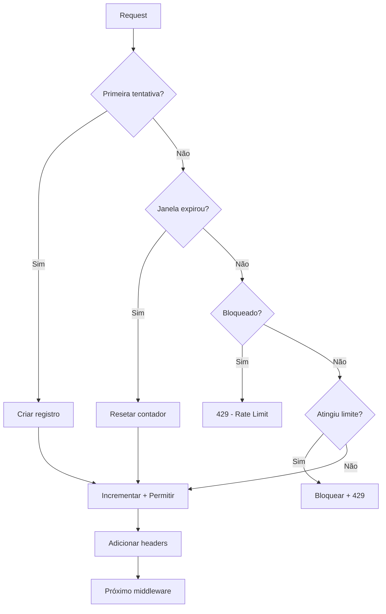

# Rate Limiter Middleware - Guia Completo

## Visão Geral

O middleware de rate limiting protege endpoints de login contra ataques de força bruta, limitando o número de tentativas de autenticação por IP e email.

**Validates: Requirements 5.7**

## Características

- ✅ Limita tentativas de login a **5 por 15 minutos** por IP/email
- ✅ Rastreamento combinado por IP + email
- ✅ Retorna status **429 (Too Many Requests)** quando limite excedido
- ✅ Headers informativos de rate limit (X-RateLimit-*)
- ✅ Armazenamento em memória (in-memory store)
- ✅ Limpeza automática de registros expirados
- ✅ Suporte a proxies (x-forwarded-for, x-real-ip)
- ✅ Email case-insensitive
- ✅ Fail-open em caso de erro (não bloqueia por bugs)

## Instalação e Uso

### Uso Básico

```javascript
const express = require('express');
const { rateLimiter } = require('./middleware/auth');

const app = express();

// Aplicar rate limiter no endpoint de login
app.post('/api/auth/login', rateLimiter, loginHandler);
```

### Uso com Múltiplos Middlewares

```javascript
const { verifyToken, rateLimiter } = require('./middleware/auth');

// Rate limiter deve vir ANTES da lógica de autenticação
app.post('/api/auth/login', 
  rateLimiter,      // 1. Verificar rate limit
  loginHandler      // 2. Processar login
);

// Para rotas protegidas (não precisa de rate limiter)
app.get('/api/protected/resource',
  verifyToken,      // Apenas verificar token
  resourceHandler
);
```

## Configuração

### Constantes

```javascript
const MAX_ATTEMPTS = 5;           // Máximo de tentativas
const WINDOW_MS = 15 * 60 * 1000; // Janela de tempo (15 minutos)
const CLEANUP_INTERVAL = 60 * 1000; // Limpeza a cada 1 minuto
```

### Customização

Para alterar os limites, edite as constantes em `rateLimiter.js`:

```javascript
// Exemplo: 10 tentativas em 30 minutos
const MAX_ATTEMPTS = 10;
const WINDOW_MS = 30 * 60 * 1000;
```

## Comportamento

### Rastreamento de Tentativas

O rate limiter rastreia tentativas usando uma chave única:

- **Com email**: `IP:email` (ex: `192.168.1.1:user@example.com`)
- **Sem email**: `IP` (ex: `192.168.1.1`)

Isso significa que:
- Mesmo IP com emails diferentes = contadores separados
- Mesmo email de IPs diferentes = contadores separados
- Email é case-insensitive (`User@Example.COM` = `user@example.com`)

### Fluxo de Verificação



### Janela de Tempo

- **Janela deslizante**: 15 minutos a partir da primeira tentativa
- **Reset automático**: Após 15 minutos, contador é resetado
- **Limpeza periódica**: Registros expirados são removidos a cada 1 minuto

## Respostas

### Requisição Permitida (Status 200)

```json
// Headers
X-RateLimit-Limit: 5
X-RateLimit-Remaining: 3
X-RateLimit-Reset: 2025-01-15T10:30:00.000Z

// Body (do handler de login)
{
  "success": true,
  "token": "...",
  "user": { ... }
}
```

### Limite Excedido (Status 429)

```json
{
  "success": false,
  "message": "Limite de tentativas de login excedido. Tente novamente em 12 minuto(s).",
  "code": "RATE_LIMIT_EXCEEDED",
  "retryAfter": 720,
  "maxAttempts": 5,
  "windowMinutes": 15
}
```

### Campos da Resposta

| Campo | Tipo | Descrição |
|-------|------|-----------|
| `success` | boolean | Sempre `false` quando bloqueado |
| `message` | string | Mensagem amigável em português |
| `code` | string | `RATE_LIMIT_EXCEEDED` |
| `retryAfter` | number | Segundos até poder tentar novamente |
| `maxAttempts` | number | Limite de tentativas (5) |
| `windowMinutes` | number | Janela de tempo em minutos (15) |

## Headers de Rate Limit

O middleware adiciona headers informativos em todas as requisições:

| Header | Descrição | Exemplo |
|--------|-----------|---------|
| `X-RateLimit-Limit` | Máximo de tentativas permitidas | `5` |
| `X-RateLimit-Remaining` | Tentativas restantes | `3` |
| `X-RateLimit-Reset` | Timestamp de reset do contador | `2025-01-15T10:30:00.000Z` |

## Funções Auxiliares

### resetAttempts(ip, email)

Reseta o contador de tentativas para um IP/email específico.

```javascript
const { resetAttempts } = require('./middleware/rateLimiter');

// Resetar após login bem-sucedido
app.post('/api/auth/login', rateLimiter, async (req, res) => {
  const { email, password } = req.body;
  
  const user = await authenticateUser(email, password);
  
  if (user) {
    // Login bem-sucedido - resetar contador
    const ip = req.headers['x-forwarded-for'] || req.ip;
    resetAttempts(ip, email);
    
    return res.json({ success: true, user });
  }
  
  return res.status(401).json({ success: false });
});
```

### getAttemptStats(ip, email)

Obtém estatísticas de tentativas para um IP/email.

```javascript
const { getAttemptStats } = require('./middleware/rateLimiter');

// Endpoint de debug (apenas para desenvolvimento)
app.get('/api/debug/rate-limit-stats', (req, res) => {
  const { ip, email } = req.query;
  const stats = getAttemptStats(ip, email);
  
  res.json(stats);
});

// Retorna:
// {
//   attempts: 3,
//   blocked: false,
//   remaining: 2,
//   resetAt: "2025-01-15T10:30:00.000Z"
// }
```

### clearAllAttempts()

Limpa todos os registros de rate limiting. **Usar apenas em testes.**

```javascript
const { clearAllAttempts } = require('./middleware/rateLimiter');

// Em testes
beforeEach(() => {
  clearAllAttempts();
});
```

## Extração de IP

O middleware extrai o IP real do cliente considerando proxies:

1. **x-forwarded-for** (primeiro IP da lista)
2. **x-real-ip**
3. **req.connection.remoteAddress**
4. **req.socket.remoteAddress**
5. **req.ip**

### Exemplo com Proxy

```javascript
// Request através de proxy
Headers: {
  'x-forwarded-for': '203.0.113.1, 198.51.100.1',
  'x-real-ip': '203.0.113.1'
}

// IP usado: 203.0.113.1 (primeiro do x-forwarded-for)
```

## Segurança

### Fail-Open Strategy

Em caso de erro interno, o middleware **permite a requisição** (fail-open):

```javascript
try {
  // Lógica de rate limiting
} catch (error) {
  console.error('Erro no rate limiter:', error);
  next(); // Permite a requisição
}
```

**Razão**: Evitar que bugs no rate limiter bloqueiem todos os logins legítimos.

### Proteção contra Bypass

- ✅ Rastreamento por IP + email (não apenas um)
- ✅ Email case-insensitive (evita bypass com maiúsculas)
- ✅ Suporte a proxies (x-forwarded-for)
- ✅ Limpeza automática (evita memory leak)

### Limitações

⚠️ **Armazenamento em memória**:
- Dados são perdidos ao reiniciar o servidor
- Não compartilhado entre múltiplas instâncias
- Para produção com múltiplos servidores, considere Redis

⚠️ **IP Spoofing**:
- Confia em headers de proxy (x-forwarded-for)
- Configure proxy reverso (nginx, cloudflare) corretamente

## Migração para Redis (Produção)

Para ambientes com múltiplos servidores, use Redis:

```javascript
const redis = require('redis');
const client = redis.createClient();

async function rateLimiter(req, res, next) {
  const key = generateKey(ip, email);
  
  // Incrementar contador no Redis
  const count = await client.incr(key);
  
  if (count === 1) {
    // Primeira tentativa - definir expiração
    await client.expire(key, 900); // 15 minutos
  }
  
  if (count > MAX_ATTEMPTS) {
    return res.status(429).json({ ... });
  }
  
  next();
}
```

## Testes

### Executar Testes Unitários

```bash
node backend/middleware/rateLimiter.test.js
```

### Executar Testes de Integração

```bash
node backend/middleware/rateLimiter.integration.test.js
```

### Cenários de Teste

- ✅ Permitir primeiras 5 tentativas
- ✅ Bloquear 6ª tentativa
- ✅ Rastreamento por IP + email
- ✅ IPs diferentes independentes
- ✅ Reset após janela de tempo
- ✅ Headers de rate limit
- ✅ Extração de IP de proxies
- ✅ Email case-insensitive
- ✅ Fail-open em erros
- ✅ Ataques de força bruta
- ✅ Requisições concorrentes

## Monitoramento

### Logs

O middleware registra erros no console:

```javascript
console.error('❌ Erro no middleware de rate limiting:', error);
```

### Métricas Recomendadas

Para produção, monitore:

- **Taxa de bloqueio**: Quantas requisições são bloqueadas
- **IPs bloqueados**: Quais IPs estão sendo bloqueados frequentemente
- **Tentativas por IP**: Distribuição de tentativas
- **Falsos positivos**: Usuários legítimos bloqueados

### Exemplo de Logging

```javascript
function rateLimiter(req, res, next) {
  // ... lógica existente ...
  
  if (record.blocked) {
    // Log de bloqueio
    console.warn('🚫 Rate limit bloqueou:', {
      ip,
      email,
      attempts: record.count,
      timestamp: new Date().toISOString()
    });
  }
  
  // ... resto do código ...
}
```

## Troubleshooting

### Problema: Usuários legítimos sendo bloqueados

**Solução**: Aumentar MAX_ATTEMPTS ou WINDOW_MS

```javascript
const MAX_ATTEMPTS = 10; // Aumentar de 5 para 10
```

### Problema: Rate limiter não funciona entre reinicializações

**Causa**: Armazenamento em memória é volátil

**Solução**: Migrar para Redis (ver seção acima)

### Problema: Rate limiter não funciona com múltiplos servidores

**Causa**: Cada servidor tem seu próprio armazenamento em memória

**Solução**: Usar Redis compartilhado entre servidores

### Problema: IP sempre aparece como 127.0.0.1

**Causa**: Proxy reverso não está configurado corretamente

**Solução**: Configurar nginx/cloudflare para passar x-forwarded-for

```nginx
# nginx.conf
proxy_set_header X-Forwarded-For $proxy_add_x_forwarded_for;
proxy_set_header X-Real-IP $remote_addr;
```

## Exemplos Completos

### Exemplo 1: Login com Rate Limiter

```javascript
const express = require('express');
const { rateLimiter, resetAttempts } = require('./middleware/auth');
const { createClient } = require('@supabase/supabase-js');

const app = express();
const supabase = createClient(process.env.SUPABASE_URL, process.env.SUPABASE_KEY);

app.post('/api/auth/login', rateLimiter, async (req, res) => {
  const { email, password } = req.body;
  
  // Validação
  if (!email || !password) {
    return res.status(400).json({
      success: false,
      message: 'Email e senha são obrigatórios'
    });
  }
  
  // Autenticar com Supabase
  const { data, error } = await supabase.auth.signInWithPassword({
    email,
    password
  });
  
  if (error) {
    return res.status(401).json({
      success: false,
      message: 'Credenciais inválidas'
    });
  }
  
  // Login bem-sucedido - resetar rate limit
  const ip = req.headers['x-forwarded-for'] || req.ip;
  resetAttempts(ip, email);
  
  return res.json({
    success: true,
    session: data.session,
    user: data.user
  });
});
```

### Exemplo 2: Endpoint de Status

```javascript
app.get('/api/auth/rate-limit-status', (req, res) => {
  const { email } = req.query;
  const ip = req.headers['x-forwarded-for'] || req.ip;
  
  const stats = getAttemptStats(ip, email);
  
  res.json({
    ip,
    email,
    ...stats,
    message: stats.blocked 
      ? 'Você está temporariamente bloqueado'
      : `Você tem ${stats.remaining} tentativas restantes`
  });
});
```

### Exemplo 3: Admin Reset

```javascript
// Endpoint administrativo para resetar rate limit de um usuário
app.post('/api/admin/reset-rate-limit', verifyToken, async (req, res) => {
  // Verificar se é admin
  if (req.user.role !== 'admin') {
    return res.status(403).json({ message: 'Acesso negado' });
  }
  
  const { ip, email } = req.body;
  
  resetAttempts(ip, email);
  
  res.json({
    success: true,
    message: 'Rate limit resetado com sucesso'
  });
});
```

## Requisitos Validados

Este middleware valida o seguinte requisito da especificação:

- **Requisito 5.7**: THE Sistema_Auth SHALL limitar tentativas de login a 5 por período de 15 minutos

## Próximos Passos

1. ✅ Implementar rate limiter (Task 3.3) - **CONCLUÍDO**
2. ⏭️ Implementar access logging middleware (Task 3.4)
3. ⏭️ Integrar rate limiter com endpoints de autenticação (Task 6.2)
4. ⏭️ Considerar migração para Redis em produção

## Referências

- [Express Rate Limit](https://www.npmjs.com/package/express-rate-limit)
- [OWASP: Blocking Brute Force Attacks](https://owasp.org/www-community/controls/Blocking_Brute_Force_Attacks)
- [RFC 6585: Additional HTTP Status Codes](https://tools.ietf.org/html/rfc6585#section-4)
