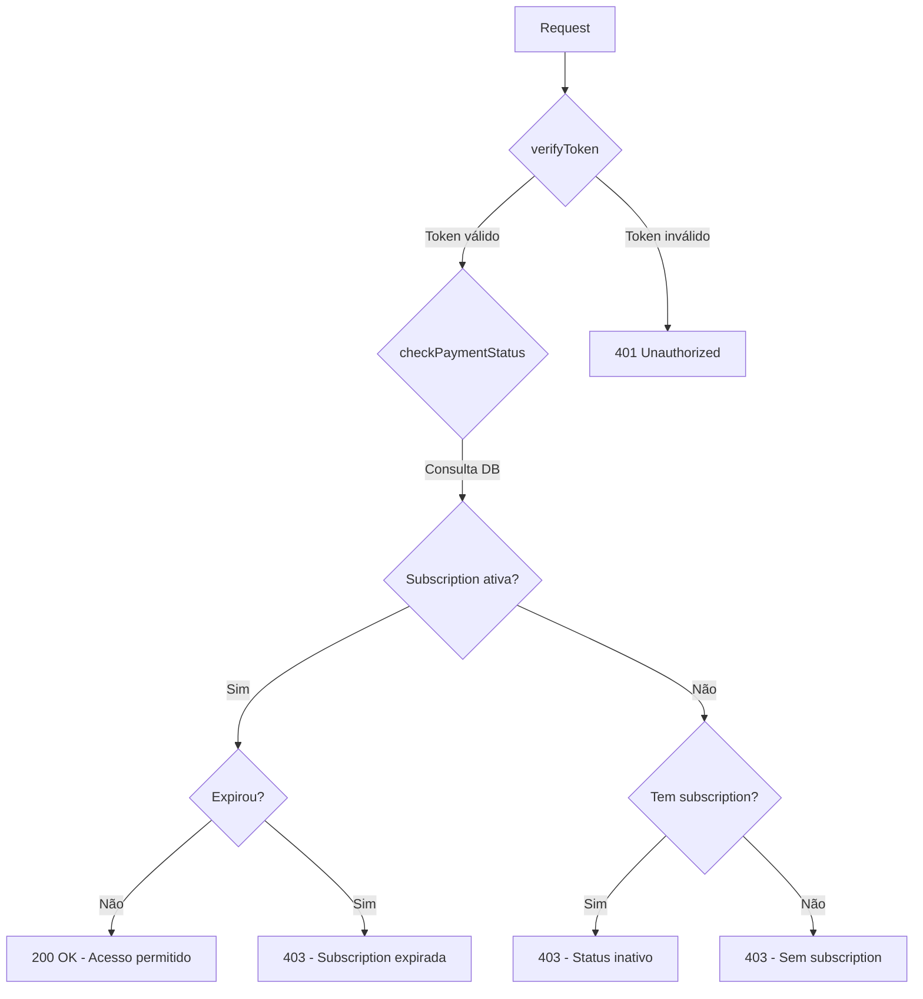

# Authentication Middleware

Este diretório contém os middlewares de autenticação e autorização para o sistema.

## Middlewares Disponíveis

1. **verifyToken** - Valida tokens JWT do Supabase
2. **checkPaymentStatus** - Verifica status de pagamento do usuário (Task 3.2)
3. **rateLimiter** - Limita tentativas de login para prevenir força bruta (Task 3.3)

---

## verifyToken Middleware

Middleware para verificar tokens JWT do Supabase e proteger rotas da API.

### Funcionalidades

- ✅ Valida tokens JWT do Supabase
- ✅ Extrai dados do usuário do token
- ✅ Anexa informações do usuário ao objeto `req.user`
- ✅ Trata erros de token expirado
- ✅ Trata erros de token inválido
- ✅ Retorna mensagens de erro claras e códigos específicos

### Uso Básico

```javascript
const { verifyToken } = require('./middleware/auth');

// Aplicar middleware em uma rota específica
app.get('/api/protected/resource', verifyToken, (req, res) => {
  // req.user está disponível aqui
  res.json({
    message: 'Acesso autorizado',
    user: req.user
  });
});

// Aplicar middleware em múltiplas rotas
app.use('/api/protected/*', verifyToken);
```

### Objeto req.user

Após a validação bem-sucedida, o middleware anexa os seguintes dados ao request:

```javascript
req.user = {
  id: 'uuid-do-usuario',
  email: 'usuario@example.com',
  role: 'user',
  email_confirmed_at: '2025-01-01T00:00:00Z',
  created_at: '2025-01-01T00:00:00Z'
}
```

### Formato do Token

O token deve ser enviado no header `Authorization` no formato:

```
Authorization: Bearer <token-jwt>
```

### Códigos de Erro

| Código | Status | Descrição |
|--------|--------|-----------|
| `NO_TOKEN` | 401 | Token não fornecido no header Authorization |
| `INVALID_TOKEN_FORMAT` | 401 | Formato do token inválido (não é "Bearer <token>") |
| `TOKEN_EXPIRED` | 401 | Token expirado, usuário precisa fazer login novamente |
| `INVALID_TOKEN` | 401 | Token inválido ou malformado |
| `USER_NOT_FOUND` | 401 | Usuário não encontrado no sistema |
| `AUTH_FAILED` | 401 | Falha genérica na autenticação |
| `INTERNAL_ERROR` | 500 | Erro interno do servidor |

### Exemplo de Resposta de Erro

```json
{
  "success": false,
  "message": "Token expirado. Faça login novamente.",
  "code": "TOKEN_EXPIRED"
}
```

### Requisitos Validados

Este middleware valida os seguintes requisitos da especificação:

- **Requisito 5.2**: Autenticação via Supabase com validação de credenciais
- **Requisito 5.3**: Criação de sessão de usuário após autenticação bem-sucedida
- **Requisito 5.4**: Geração e validação de token de acesso
- **Requisito 9.2**: Invalidação de token quando sessão expira

### Testes

Execute os testes do middleware com:

```bash
npm test middleware/auth.test.js
```

### Próximos Passos

Para implementar controle de acesso completo, use o middleware `checkPaymentStatus` em conjunto com `verifyToken`.

Para proteger endpoints de login contra ataques de força bruta, use o middleware `rateLimiter`.

---

## rateLimiter Middleware

Middleware para limitar tentativas de login e prevenir ataques de força bruta.

### Funcionalidades

- ✅ Limita tentativas de login a 5 por 15 minutos por IP/email
- ✅ Rastreamento combinado por IP + email
- ✅ Retorna status 429 (Too Many Requests) quando limite excedido
- ✅ Headers informativos de rate limit (X-RateLimit-*)
- ✅ Armazenamento em memória com limpeza automática
- ✅ Suporte a proxies (x-forwarded-for, x-real-ip)
- ✅ Email case-insensitive
- ✅ Fail-open em caso de erro

### Uso Básico

```javascript
const { rateLimiter } = require('./middleware/auth');

// Aplicar rate limiter no endpoint de login
app.post('/api/auth/login', rateLimiter, loginHandler);

// Usar com múltiplos middlewares
app.post('/api/auth/login', 
  rateLimiter,      // 1. Verificar rate limit
  loginHandler      // 2. Processar login
);
```

### Configuração

```javascript
const MAX_ATTEMPTS = 5;           // Máximo de tentativas
const WINDOW_MS = 15 * 60 * 1000; // Janela de tempo (15 minutos)
```

### Rastreamento de Tentativas

O rate limiter rastreia tentativas usando uma chave única:

- **Com email**: `IP:email` (ex: `192.168.1.1:user@example.com`)
- **Sem email**: `IP` (ex: `192.168.1.1`)

Isso significa que:
- Mesmo IP com emails diferentes = contadores separados
- Mesmo email de IPs diferentes = contadores separados
- Email é case-insensitive (`User@Example.COM` = `user@example.com`)

### Códigos de Resposta

| Status | Descrição |
|--------|-----------|
| `200` | Requisição permitida (dentro do limite) |
| `429` | Limite excedido (Too Many Requests) |

### Exemplo de Resposta Bloqueada (Status 429)

```json
{
  "success": false,
  "message": "Limite de tentativas de login excedido. Tente novamente em 12 minuto(s).",
  "code": "RATE_LIMIT_EXCEEDED",
  "retryAfter": 720,
  "maxAttempts": 5,
  "windowMinutes": 15
}
```

### Headers de Rate Limit

O middleware adiciona headers informativos em todas as requisições:

| Header | Descrição | Exemplo |
|--------|-----------|---------|
| `X-RateLimit-Limit` | Máximo de tentativas permitidas | `5` |
| `X-RateLimit-Remaining` | Tentativas restantes | `3` |
| `X-RateLimit-Reset` | Timestamp de reset do contador | `2025-01-15T10:30:00.000Z` |

### Funções Auxiliares

#### resetAttempts(ip, email)

Reseta o contador de tentativas para um IP/email específico. Útil após login bem-sucedido.

```javascript
const { rateLimiter, resetAttempts } = require('./middleware/auth');

app.post('/api/auth/login', rateLimiter, async (req, res) => {
  const { email, password } = req.body;
  const user = await authenticateUser(email, password);
  
  if (user) {
    // Login bem-sucedido - resetar contador
    const ip = req.headers['x-forwarded-for'] || req.ip;
    resetAttempts(ip, email);
    
    return res.json({ success: true, user });
  }
  
  return res.status(401).json({ success: false });
});
```

#### getAttemptStats(ip, email)

Obtém estatísticas de tentativas para um IP/email.

```javascript
const { getAttemptStats } = require('./middleware/rateLimiter');

const stats = getAttemptStats('192.168.1.1', 'user@example.com');
// Retorna:
// {
//   attempts: 3,
//   blocked: false,
//   remaining: 2,
//   resetAt: "2025-01-15T10:30:00.000Z"
// }
```

#### clearAllAttempts()

Limpa todos os registros de rate limiting. **Usar apenas em testes.**

```javascript
const { clearAllAttempts } = require('./middleware/rateLimiter');

beforeEach(() => {
  clearAllAttempts();
});
```

### Requisitos Validados

Este middleware valida os seguintes requisitos da especificação:

- **Requisito 5.7**: Limitar tentativas de login a 5 por período de 15 minutos

### Documentação Completa

Para documentação detalhada, exemplos avançados e troubleshooting, consulte:
- [RATE_LIMITER_GUIDE.md](./RATE_LIMITER_GUIDE.md) - Guia completo do rate limiter

### Testes

Execute os testes do middleware com:

```bash
# Testes unitários
node backend/middleware/rateLimiter.test.js

# Testes de integração
node backend/middleware/rateLimiter.integration.test.js
```

### Limitações e Considerações

⚠️ **Armazenamento em memória**:
- Dados são perdidos ao reiniciar o servidor
- Não compartilhado entre múltiplas instâncias
- Para produção com múltiplos servidores, considere migrar para Redis

⚠️ **Segurança**:
- Confia em headers de proxy (x-forwarded-for)
- Configure proxy reverso (nginx, cloudflare) corretamente
- Fail-open strategy: permite requisições em caso de erro interno

### Próximos Passos

---

## checkPaymentStatus Middleware

Middleware para verificar o status de pagamento do usuário e controlar acesso baseado em assinatura ativa.

### Funcionalidades

- ✅ Consulta subscription ativa do usuário na tabela `subscriptions`
- ✅ Verifica se o status é "ativo"
- ✅ Valida data de expiração da subscription
- ✅ Anexa dados da subscription ao objeto `req.subscription`
- ✅ Retorna mensagens contextuais baseadas no status (expirado, pendente, cancelado)
- ✅ Bloqueia acesso para usuários sem subscription ativa

### Uso Básico

```javascript
const { verifyToken, checkPaymentStatus } = require('./middleware/auth');

// Aplicar ambos middlewares em rotas protegidas
app.get('/api/lead-extractor/*', 
  verifyToken,           // Primeiro: verifica autenticação
  checkPaymentStatus,    // Segundo: verifica pagamento
  (req, res) => {
    // req.user e req.subscription estão disponíveis aqui
    res.json({
      message: 'Acesso autorizado',
      user: req.user,
      subscription: req.subscription
    });
  }
);

// Aplicar em múltiplas rotas protegidas
app.use('/api/protected/*', verifyToken, checkPaymentStatus);
```

### Objeto req.subscription

Após a validação bem-sucedida, o middleware anexa os seguintes dados ao request:

```javascript
req.subscription = {
  id: 'uuid-da-subscription',
  plan_id: 'start', // ou 'sovereign'
  status: 'ativo',
  extraction_limit: 50, // ou null para ilimitado
  extractions_used: 10,
  activated_at: '2025-01-01T00:00:00Z',
  expires_at: '2025-02-01T00:00:00Z',
  created_at: '2025-01-01T00:00:00Z'
}
```

### Pré-requisitos

⚠️ **IMPORTANTE**: Este middleware deve ser usado **APÓS** o `verifyToken` middleware, pois depende de `req.user.id` para funcionar.

```javascript
// ✅ CORRETO
app.get('/api/resource', verifyToken, checkPaymentStatus, handler);

// ❌ ERRADO - checkPaymentStatus precisa de req.user
app.get('/api/resource', checkPaymentStatus, handler);
```

### Códigos de Erro

| Código | Status | Descrição |
|--------|--------|-----------|
| `NOT_AUTHENTICATED` | 401 | Usuário não autenticado (verifyToken não foi executado) |
| `PAYMENT_INACTIVE` | 403 | Subscription existe mas não está ativa (expirado/pendente/cancelado) |
| `NO_SUBSCRIPTION` | 403 | Usuário não possui nenhuma subscription |
| `SUBSCRIPTION_EXPIRED` | 403 | Subscription expirou (verificação adicional de data) |
| `DATABASE_ERROR` | 500 | Erro ao consultar banco de dados |
| `INTERNAL_ERROR` | 500 | Erro interno do servidor |

### Exemplos de Resposta

#### Acesso Permitido (Status 200)
```json
{
  "message": "Acesso autorizado",
  "user": { "id": "...", "email": "..." },
  "subscription": {
    "id": "...",
    "plan_id": "start",
    "status": "ativo",
    "extraction_limit": 50,
    "extractions_used": 10
  }
}
```

#### Subscription Expirada (Status 403)
```json
{
  "success": false,
  "message": "Sua assinatura expirou. Renove para continuar acessando a plataforma.",
  "code": "PAYMENT_INACTIVE",
  "status": "expirado"
}
```

#### Pagamento Pendente (Status 403)
```json
{
  "success": false,
  "message": "Seu pagamento está pendente. Complete o pagamento para acessar a plataforma.",
  "code": "PAYMENT_INACTIVE",
  "status": "pendente"
}
```

#### Subscription Cancelada (Status 403)
```json
{
  "success": false,
  "message": "Sua assinatura foi cancelada. Reative para continuar acessando a plataforma.",
  "code": "PAYMENT_INACTIVE",
  "status": "cancelado"
}
```

#### Sem Subscription (Status 403)
```json
{
  "success": false,
  "message": "Nenhuma assinatura encontrada. Adquira um plano para acessar a plataforma.",
  "code": "NO_SUBSCRIPTION"
}
```

### Requisitos Validados

Este middleware valida os seguintes requisitos da especificação:

- **Requisito 7.1**: Verificação de status de pagamento no Supabase a cada request
- **Requisito 7.2**: Permitir acesso se status for "ativo"
- **Requisito 7.3**: Bloquear acesso se status for "expirado" com mensagem de renovação
- **Requisito 7.4**: Bloquear acesso se status for "pendente" com mensagem de pagamento pendente
- **Requisito 7.5**: Bloquear acesso se status for "cancelado" com mensagem de reativação
- **Requisito 7.6**: Verificar status a cada requisição para recursos protegidos

### Testes

Execute os testes de integração com:

```bash
node backend/middleware/checkPaymentStatus.integration.test.js
```

### Fluxo de Verificação



### Exemplo Completo de Uso

```javascript
const express = require('express');
const { verifyToken, checkPaymentStatus } = require('./middleware/auth');

const app = express();

// Rotas públicas (sem autenticação)
app.get('/api/pricing', (req, res) => {
  res.json({ plans: [...] });
});

// Rotas autenticadas (apenas token)
app.get('/api/profile', verifyToken, (req, res) => {
  res.json({ user: req.user });
});

// Rotas protegidas (token + pagamento ativo)
app.get('/api/lead-extractor/extract', 
  verifyToken, 
  checkPaymentStatus, 
  (req, res) => {
    // Verificar limite de extrações
    if (req.subscription.extraction_limit !== null) {
      if (req.subscription.extractions_used >= req.subscription.extraction_limit) {
        return res.status(403).json({
          success: false,
          message: 'Limite de extrações atingido',
          limit: req.subscription.extraction_limit,
          used: req.subscription.extractions_used
        });
      }
    }

    // Processar extração...
    res.json({ success: true, data: [...] });
  }
);

app.listen(3000, () => {
  console.log('Server running on port 3000');
});
```
